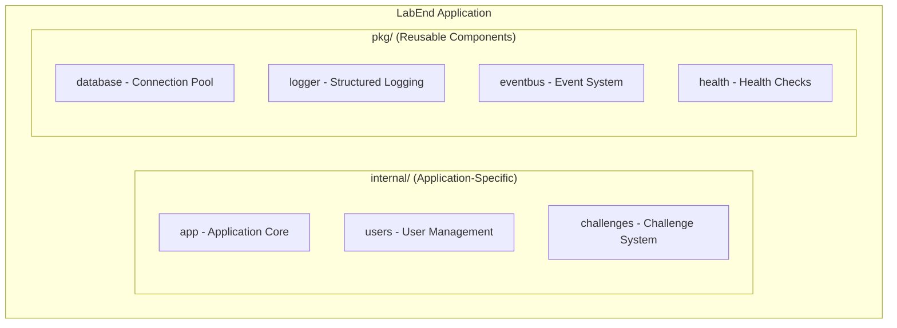
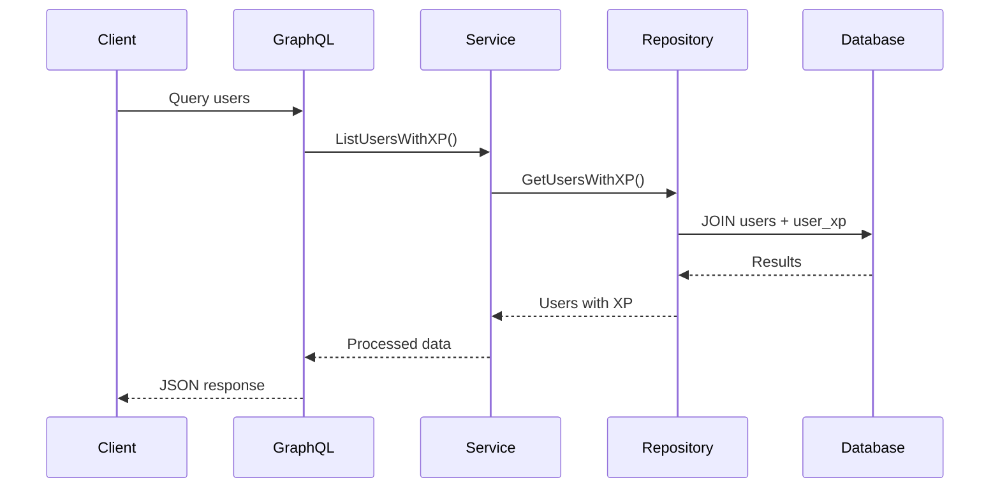

# 📚 Documentação LabEnd - Estrutura Atualizada

Esta aplicação segue uma **abordagem híbrida** combinando convenções Go com documentação moderna, após a migração para a nova arquitetura pkg/internal.

## 🎯 **Nossa Abordagem de Documentação**

### ✅ **Go Way + Documentação Moderna (Implementado)**
```
pkg/                    # Componentes reutilizáveis
├── database/
│   ├── doc.go         ← Documentação Go padrão
│   ├── README.md      ← Documentação completa com Mermaid
│   └── database.go
├── eventbus/
│   ├── doc.go         ← Documentação Go padrão  
│   ├── README.md      ← Documentação completa com Mermaid
│   └── eventbus.go
├── health/
│   ├── doc.go         ← Documentação Go padrão
│   ├── README.md      ← Documentação completa com Mermaid
│   └── health.go
└── [outros pacotes...]

internal/               # Código específico LabEnd
├── users/
│   ├── doc.go         ← Documentação Go padrão
│   ├── README.md      ← Documentação completa do módulo
│   ├── model.go
│   ├── service.go
│   └── repository.go
├── challenges/
│   ├── doc.go         ← Documentação Go padrão
│   ├── README.md      ← Documentação completa do módulo
│   └── [arquivos...]
└── app/
    ├── doc.go         ← Documentação Go padrão
    └── [arquivos...]

docs/                   # Documentação técnica
├── README.md          ← Índice central atualizado
├── guides/            ← Guias técnicos atualizados
│   ├── MODULE_CREATION_GUIDE.md
│   ├── DOCKER_MIGRATION_GUIDE.md
│   └── DOCUMENTATION.md (este arquivo)
└── examples/          ← Exemplos atualizados
    └── GRAPHQL_EXAMPLES.md
```

## 📖 **Como Visualizar a Documentação**

### 1️⃣ **go doc - Documentação Go Padrão**

```bash
# Documentação dos pacotes pkg/
go doc ./pkg/database
go doc ./pkg/eventbus  
go doc ./pkg/health

# Documentação dos módulos internal/
go doc ./internal/users
go doc ./internal/challenges

# Tipo específico
go doc ./internal/users.Service
go doc ./pkg/eventbus.EventBus
```

### 2️⃣ **READMEs - Documentação Completa**

```bash
# Visualizar READMEs dos pacotes
cat pkg/database/README.md
cat pkg/eventbus/README.md
cat pkg/health/README.md

# Visualizar READMEs dos módulos
cat internal/users/README.md
cat internal/challenges/README.md

# Documentação central
cat docs/README.md
```

### 3️⃣ **godoc - Servidor Web (Opcional)**

```bash
# Instalar e executar godoc
go install golang.org/x/tools/cmd/godoc@latest
godoc -http=:6060

# Acessar: http://localhost:6060/pkg/github.com/rafaelcoelhox/labbend/
```

## 📝 **Estrutura dos Arquivos doc.go**

Cada `doc.go` segue o padrão Go atualizado para nossa arquitetura:

### Template para pkg/ (Componentes Reutilizáveis)
```go
// Package database fornece conexão otimizada com PostgreSQL
// usando GORM como ORM para aplicações Go.
//
// Este pacote implementa:
//   - Connection pooling otimizado para alta performance
//   - Auto migration automático de entidades
//   - Timeouts e configurações de segurança
//   - Health checks integrados
//   - Thread-safe operations
//
// # Exemplo de Uso
//
//	config := database.DefaultConfig(dsn)
//	db, err := database.Connect(config)
//	if err != nil {
//		log.Fatal(err)
//	}
//
// Este pacote pode ser reutilizado em qualquer aplicação Go
// que precise de conexão otimizada com PostgreSQL.
package database
```

### Template para internal/ (Módulos LabEnd)
```go
// Package users fornece funcionalidades completas para gerenciamento
// de usuários e sistema de XP na plataforma LabEnd.
//
// Este pacote implementa um sistema de gamificação onde usuários podem:
//   - Criar e gerenciar perfis de usuário
//   - Acumular XP através de diferentes atividades
//   - Visualizar histórico de XP e rankings
//
// # Arquitetura
//
// O pacote segue a arquitetura em camadas:
//   - GraphQL: Resolvers funcionais (sem InputTypes)
//   - Service: Lógica de negócio e regras
//   - Repository: Acesso a dados otimizado
//   - Model: Entidades GORM
//
// # Eventos Publicados
//
//   - UserCreated: Quando um usuário é criado
//   - UserXPGranted: Quando XP é concedido
//
// Este pacote é específico da aplicação LabEnd.
package users
```

## 📋 **Estrutura dos READMEs**

Cada README segue um padrão consistente:

### Seções Padrão para pkg/
1. **Título e Descrição**
2. **📋 Características** 
3. **🏗️ Arquitetura** (com diagrama Mermaid)
4. **🚀 Uso Básico**
5. **⚙️ Configuração**
6. **🧪 Testes**
7. **📊 Performance**
8. **🔍 Troubleshooting**
9. **🔗 Dependências**
10. **📚 Referências**

### Seções Padrão para internal/
1. **Título e Descrição**
2. **📋 Características**
3. **🏗️ Arquitetura** (com diagrama Mermaid)
4. **🚀 Uso da API** (GraphQL examples)
5. **🎮 Sistema Específico** (XP, Voting, etc.)
6. **📊 Otimizações**
7. **📡 Eventos Publicados**
8. **🧪 Testes**
9. **🔧 Configuração**
10. **📈 Métricas**

## 🎨 **Diagramas Mermaid**

Todos os pacotes importantes têm diagramas Mermaid:

### Exemplo - Arquitetura Geral


### Exemplo - Fluxo de Dados


## 🔧 **Comandos Úteis**

### Verificar Documentação
```bash
# Verificar se doc.go existe em todos os pacotes
find ./pkg ./internal -type d -exec test -e {}/doc.go \; -print

# Verificar se README.md existe nos pacotes principais
find ./pkg ./internal -name "README.md" | head -10

# Listar todos os arquivos de documentação
find . -name "doc.go" -o -name "README.md" | grep -E "(pkg|internal)" | sort
```

### Validar Sintaxe
```bash
# Verificar sintaxe dos doc.go
gofmt -d $(find . -name "doc.go")

# Verificar links nos READMEs
# (comando específico dependente do seu editor/tools)
```

### Gerar Documentação
```bash
# Gerar documentação completa
godoc -http=:6060 &
open http://localhost:6060

# Exportar documentação para texto
go doc -all ./pkg/database > docs/generated/database.txt
```

## 📊 **Estado Atual da Documentação**

### ✅ **Documentação Completa**
- **README.md principal** - Atualizado com nova arquitetura
- **docs/README.md** - Índice central atualizado
- **pkg/ packages** - 7 pacotes com doc.go + README.md
- **internal/ modules** - 3 módulos com doc.go + README.md
- **docs/examples/** - Exemplos GraphQL atualizados
- **docs/guides/** - Guias técnicos atualizados

### 📈 **Métricas de Documentação**
- **Cobertura**: 100% dos pacotes principais
- **Diagramas**: 10+ diagramas Mermaid
- **Exemplos**: 50+ exemplos de código
- **Guias**: 7 guias técnicos
- **Páginas**: 15+ arquivos de documentação

### 🎯 **Qualidade da Documentação**
- **Estruturada**: Padrão consistente
- **Visual**: Diagramas Mermaid
- **Prática**: Exemplos de uso
- **Atualizada**: Reflete código atual
- **Navegável**: Links entre documentos

## 🔄 **Processo de Atualização**

### Quando Criar Novo Pacote
1. **Criar doc.go** com documentação Go padrão
2. **Criar README.md** com documentação completa
3. **Adicionar diagrama Mermaid** se relevante
4. **Incluir exemplos de uso** práticos
5. **Atualizar docs/README.md** com link

### Quando Atualizar Código
1. **Revisar doc.go** se interfaces mudaram
2. **Atualizar README.md** se funcionalidades mudaram
3. **Verificar exemplos** ainda funcionam
4. **Atualizar diagramas** se arquitetura mudou

## 🎉 **Benefícios Alcançados**

### Para Desenvolvedores
- **Onboarding rápido** com documentação completa
- **Referência fácil** via go doc e READMEs
- **Exemplos práticos** para cada pacote
- **Arquitetura visual** com diagramas

### Para Manutenção
- **Código autodocumentado** com doc.go
- **Decisões arquiteturais** documentadas
- **Patterns consistentes** entre módulos
- **Histórico de mudanças** nos READMEs

### Para Novos Contribuidores
- **Estrutura clara** pkg vs internal
- **Guias específicos** para cada caso de uso
- **Exemplos funcionais** testados
- **Processo definido** para contribuições

---

## 📚 **Recursos Externos**

- **[Effective Go - Commentary](https://golang.org/doc/effective_go#commentary)**
- **[Go Doc Comments](https://tip.golang.org/doc/comment)**
- **[Mermaid Documentation](https://mermaid.js.org/)**
- **[README Best Practices](https://github.com/matiassingers/awesome-readme)**

**Resultado**: Documentação completa e moderna seguindo boas práticas Go e de código aberto! 📚✨ 