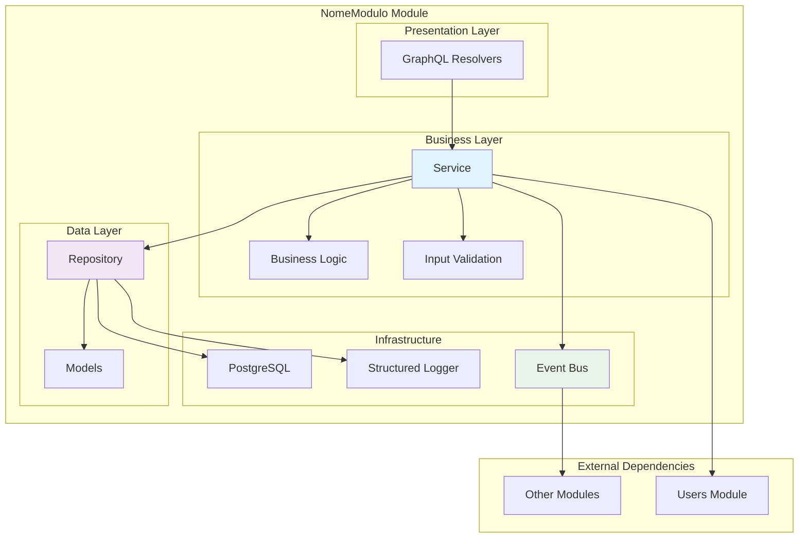

# 🏗️ Manual Completo de Criação de Módulos LabEnd

Este manual fornece templates completos e exemplos práticos para criar novos módulos na aplicação LabEnd seguindo os padrões arquiteturais existentes.

## 📋 Índice

- [Visão Geral](#visão-geral)
- [Arquitetura de Módulos](#arquitetura-de-módulos)
- [Estrutura de Arquivos](#estrutura-de-arquivos)
- [Templates Completos](#templates-completos)
- [Configuração e Integração](#configuração-e-integração)
- [Testes e Mocks](#testes-e-mocks)
- [Exemplo Prático](#exemplo-prático)
- [Checklist de Criação](#checklist-de-criação)

## 🎯 Visão Geral

A aplicação LabEnd segue uma arquitetura modular baseada em **Domain-Driven Design (DDD)** com separação clara entre:

- **`pkg/`**: Componentes reutilizáveis (database, logger, eventbus, etc.)
- **`internal/`**: Código específico da aplicação (módulos de domínio)

### 🚀 **Novo Sistema de Registro Automático**

A partir da versão atual, a aplicação utiliza um **sistema de registro automático de módulos** que simplifica drasticamente a integração de novos módulos:

#### ✅ **Como Funciona**
1. **ModuleRegistry**: Gerencia dinamicamente todos os módulos
2. **Adapters**: Conectam services com GraphQL automaticamente
3. **Auto-Discovery**: Detecta e integra novos módulos automaticamente

#### 🎯 **Benefícios**
- **90% menos código** para integração
- **Eliminação de erros** de configuração manual
- **Integração em segundos** vs minutos
- **Escalabilidade** sem complexidade

### Arquitetura em Camadas

```
┌─────────────────────────┐
│    GraphQL Resolvers    │  ← Apresentação (HTTP/GraphQL)
├─────────────────────────┤
│    Business Service     │  ← Lógica de negócio e regras
├─────────────────────────┤
│    Repository           │  ← Acesso a dados otimizado
├─────────────────────────┤
│    Models               │  ← Entidades GORM e validações
└─────────────────────────┘
```

## 🏛️ Arquitetura de Módulos

### Padrões Observados

Análise dos módulos existentes (`users` e `challenges`) revela:

1. **Separação de Responsabilidades**: Cada camada tem uma responsabilidade específica
2. **Dependency Injection**: Interfaces injetadas via construtores
3. **Event-Driven**: Comunicação entre módulos via EventBus
4. **Transações**: Suporte a operações transacionais
5. **Observabilidade**: Logs estruturados em todas as operações

### Comunicação Entre Módulos

```go
// Exemplo: Challenges → Users (via interface)
type UserService interface {
    GiveUserXP(ctx context.Context, userID uint, sourceType, sourceID string, amount int) error
    GiveUserXPWithTx(ctx context.Context, tx *gorm.DB, userID uint, sourceType, sourceID string, amount int) error
}

// Exemplo: Users → Outros módulos (via eventos)
eventBus.Publish(eventbus.Event{
    Type:   "UserCreated",
    Source: "users",
    Data:   map[string]interface{}{"userID": user.ID},
})
```

## 📁 Estrutura de Arquivos

Cada módulo deve seguir exatamente esta estrutura:

```
internal/
└── nome_modulo/
    ├── doc.go                          # Documentação do pacote
    ├── init.go                         # Registro automático de modelos
    ├── model.go                        # Entidades GORM + validações
    ├── repository.go                   # Data access layer
    ├── service.go                      # Business logic layer
    ├── graphql.go                      # GraphQL resolvers
    ├── service_test.go                 # Testes unitários
    ├── repository_integration_test.go  # Testes de integração
    └── README.md                       # Documentação do módulo
```

## 📝 Templates Completos

### 1. `doc.go` - Documentação do Pacote

```go
 //Package nome_modulo fornece funcionalidades para [DESCRIÇÃO_DO_DOMÍNIO]
 //na plataforma LabEnd.

// Este pacote implementa [FUNCIONALIDADE_PRINCIPAL] onde:
//   - [FEATURE_1]
//   - [FEATURE_2]
//   - [FEATURE_3]
//
// # Arquitetura
//
// O pacote segue a arquitetura em camadas:
//   - Resolver: Camada de apresentação (HTTP/GraphQL)
//   - Service: Lógica de negócio e regras
//   - Repository: Acesso a dados otimizado
//   - Model: Entidades e validações
//
// # Performance
//
// O pacote implementa otimizações críticas:
//   - Query JOIN otimizada para [ENTIDADE_PRINCIPAL]
//   - Índices estratégicos no banco de dados
//   - Connection pooling com timeouts
//   - Processamento assíncrono de eventos
//
// # Eventos
//
// O pacote publica os seguintes eventos:
//   - [EVENTO_1]: Quando [CONDIÇÃO_1]
//   - [EVENTO_2]: Quando [CONDIÇÃO_2]
//   - [EVENTO_3]: Quando [CONDIÇÃO_3]
//
// # Exemplo de Uso
//
//	// Criar service
//	repo := nome_modulo.NewRepository(db)
//	service := nome_modulo.NewService(repo, logger, eventBus, txManager)
//
//	// Exemplo de operação
//	result, err := service.CreateSomething(ctx, nome_modulo.CreateInput{
//		Field1: "valor1",
//		Field2: "valor2",
//	})
//
// # Thread Safety
//
// Todas as operações são thread-safe quando usadas através do Service.
// O Repository pode ser usado concorrentemente com segurança.
package nome_modulo
```

### 2. `init.go` - Registro de Modelos

```go
package nome_modulo

import "github.com/rafaelcoelhox/labbend/pkg/database"

// init - registra automaticamente os modelos do módulo
func init() {
	database.RegisterModel(&ModeloPrincipal{})
	database.RegisterModel(&ModeloSecundario{})
	// Adicione outros modelos conforme necessário
}
```

### 3. `model.go` - Entidades e Validações

```go
package nome_modulo

import (
	"errors"
	"time"

	"gorm.io/gorm"
)

// ModeloPrincipal - entidade principal do módulo
type ModeloPrincipal struct {
	ID        uint           `json:"id" gorm:"primarykey"`
	Nome      string         `json:"nome" gorm:"not null;index"`
	Descricao string         `json:"descricao" gorm:"type:text"`
	Status    string         `json:"status" gorm:"not null;default:'active'"`
	UserID    uint           `json:"user_id" gorm:"not null;index"`
	CreatedAt time.Time      `json:"created_at" gorm:"index"`
	UpdatedAt time.Time      `json:"updated_at"`
	DeletedAt gorm.DeletedAt `json:"-" gorm:"index"`
}

// ModeloSecundario - entidade relacionada
type ModeloSecundario struct {
	ID                uint      `json:"id" gorm:"primarykey"`
	ModeloPrincipalID uint      `json:"modelo_principal_id" gorm:"not null;index"`
	UserID            uint      `json:"user_id" gorm:"not null;index"`
	Valor             int       `json:"valor" gorm:"not null"`
	Tipo              string    `json:"tipo" gorm:"not null;index"`
	CreatedAt         time.Time `json:"created_at" gorm:"index"`
}

// Constantes do domínio
const (
	StatusActive   = "active"
	StatusInactive = "inactive"
	
	TipoA = "tipo_a"
	TipoB = "tipo_b"
)

// Input types para operações
type CreateInput struct {
	Nome      string `json:"nome" validate:"required,min=2"`
	Descricao string `json:"descricao" validate:"required"`
	UserID    uint   `json:"user_id" validate:"required"`
}

type UpdateInput struct {
	Nome      *string `json:"nome,omitempty"`
	Descricao *string `json:"descricao,omitempty"`
	Status    *string `json:"status,omitempty"`
}

// Table names
func (ModeloPrincipal) TableName() string {
	return "modelo_principal"
}

func (ModeloSecundario) TableName() string {
	return "modelo_secundario"
}

// Validações
func (m *ModeloPrincipal) Validate() error {
	if m.Nome == "" {
		return ErrNomeObrigatorio
	}
	if m.UserID == 0 {
		return ErrUserIDObrigatorio
	}
	if m.Status == "" {
		m.Status = StatusActive
	}
	return nil
}

// Métodos de negócio
func (m *ModeloPrincipal) IsActive() bool {
	return m.Status == StatusActive
}

func NewModeloSecundario(principalID, userID uint, valor int, tipo string) *ModeloSecundario {
	return &ModeloSecundario{
		ModeloPrincipalID: principalID,
		UserID:            userID,
		Valor:             valor,
		Tipo:              tipo,
		CreatedAt:         time.Now(),
	}
}

// Erros do domínio
var (
	ErrNomeObrigatorio   = errors.New("nome é obrigatório")
	ErrUserIDObrigatorio = errors.New("user ID é obrigatório")
	ErrStatusInvalido    = errors.New("status inválido")
)
```

### 4. `repository.go` - Data Access Layer

```go
package nome_modulo

import (
	"context"
	"time"

	"gorm.io/gorm"
	"github.com/rafaelcoelhox/labbend/pkg/errors"
)

// Repository interface define operações de acesso a dados
type Repository interface {
	// CRUD Básico
	Create(ctx context.Context, item *ModeloPrincipal) error
	GetByID(ctx context.Context, id uint) (*ModeloPrincipal, error)
	Update(ctx context.Context, item *ModeloPrincipal) error
	Delete(ctx context.Context, id uint) error
	List(ctx context.Context, limit, offset int) ([]*ModeloPrincipal, error)
	
	// Operações específicas do domínio
	GetByUserID(ctx context.Context, userID uint) ([]*ModeloPrincipal, error)
	GetByStatus(ctx context.Context, status string) ([]*ModeloPrincipal, error)
	
	// Operações no modelo secundário
	CreateSecundario(ctx context.Context, item *ModeloSecundario) error
	GetSecundariosByPrincipalID(ctx context.Context, principalID uint) ([]*ModeloSecundario, error)
	
	// Métodos transacionais
	CreateWithTx(ctx context.Context, tx *gorm.DB, item *ModeloPrincipal) error
	CreateSecundarioWithTx(ctx context.Context, tx *gorm.DB, item *ModeloSecundario) error
	GetByIDWithTx(ctx context.Context, tx *gorm.DB, id uint) (*ModeloPrincipal, error)
	UpdateWithTx(ctx context.Context, tx *gorm.DB, item *ModeloPrincipal) error
	DeleteWithTx(ctx context.Context, tx *gorm.DB, id uint) error
}

type repository struct {
	db *gorm.DB
}

func NewRepository(db *gorm.DB) Repository {
	return &repository{db: db}
}

// === CRUD BÁSICO ===

func (r *repository) Create(ctx context.Context, item *ModeloPrincipal) error {
	ctx, cancel := context.WithTimeout(ctx, 5*time.Second)
	defer cancel()

	if err := r.db.WithContext(ctx).Create(item).Error; err != nil {
		if errors.Is(err, gorm.ErrDuplicatedKey) {
			return errors.AlreadyExists("modelo_principal", "nome", item.Nome)
		}
		return errors.Internal(err)
	}
	return nil
}

func (r *repository) GetByID(ctx context.Context, id uint) (*ModeloPrincipal, error) {
	ctx, cancel := context.WithTimeout(ctx, 5*time.Second)
	defer cancel()

	var item ModeloPrincipal
	err := r.db.WithContext(ctx).First(&item, id).Error
	if err != nil {
		if errors.Is(err, gorm.ErrRecordNotFound) {
			return nil, errors.NotFound("modelo_principal", id)
		}
		return nil, errors.Internal(err)
	}
	return &item, nil
}

func (r *repository) Update(ctx context.Context, item *ModeloPrincipal) error {
	ctx, cancel := context.WithTimeout(ctx, 5*time.Second)
	defer cancel()

	err := r.db.WithContext(ctx).Save(item).Error
	if err != nil {
		return errors.Internal(err)
	}
	return nil
}

func (r *repository) Delete(ctx context.Context, id uint) error {
	ctx, cancel := context.WithTimeout(ctx, 5*time.Second)
	defer cancel()

	err := r.db.WithContext(ctx).Delete(&ModeloPrincipal{}, id).Error
	if err != nil {
		return errors.Internal(err)
	}
	return nil
}

func (r *repository) List(ctx context.Context, limit, offset int) ([]*ModeloPrincipal, error) {
	ctx, cancel := context.WithTimeout(ctx, 5*time.Second)
	defer cancel()

	var items []*ModeloPrincipal
	err := r.db.WithContext(ctx).
		Where("status = ?", StatusActive).
		Limit(limit).
		Offset(offset).
		Order("created_at DESC").
		Find(&items).Error
	if err != nil {
		return nil, errors.Internal(err)
	}
	return items, nil
}

// === OPERAÇÕES ESPECÍFICAS ===

func (r *repository) GetByUserID(ctx context.Context, userID uint) ([]*ModeloPrincipal, error) {
	ctx, cancel := context.WithTimeout(ctx, 5*time.Second)
	defer cancel()

	var items []*ModeloPrincipal
	err := r.db.WithContext(ctx).
		Where("user_id = ? AND status = ?", userID, StatusActive).
		Order("created_at DESC").
		Find(&items).Error
	if err != nil {
		return nil, errors.Internal(err)
	}
	return items, nil
}

func (r *repository) GetByStatus(ctx context.Context, status string) ([]*ModeloPrincipal, error) {
	ctx, cancel := context.WithTimeout(ctx, 5*time.Second)
	defer cancel()

	var items []*ModeloPrincipal
	err := r.db.WithContext(ctx).
		Where("status = ?", status).
		Order("created_at DESC").
		Find(&items).Error
	if err != nil {
		return nil, errors.Internal(err)
	}
	return items, nil
}

// === MODELO SECUNDÁRIO ===

func (r *repository) CreateSecundario(ctx context.Context, item *ModeloSecundario) error {
	ctx, cancel := context.WithTimeout(ctx, 5*time.Second)
	defer cancel()

	if err := r.db.WithContext(ctx).Create(item).Error; err != nil {
		return errors.Internal(err)
	}
	return nil
}

func (r *repository) GetSecundariosByPrincipalID(ctx context.Context, principalID uint) ([]*ModeloSecundario, error) {
	ctx, cancel := context.WithTimeout(ctx, 5*time.Second)
	defer cancel()

	var items []*ModeloSecundario
	err := r.db.WithContext(ctx).
		Where("modelo_principal_id = ?", principalID).
		Order("created_at DESC").
		Find(&items).Error
	if err != nil {
		return nil, errors.Internal(err)
	}
	return items, nil
}

// === MÉTODOS TRANSACIONAIS ===

func (r *repository) CreateWithTx(ctx context.Context, tx *gorm.DB, item *ModeloPrincipal) error {
	ctx, cancel := context.WithTimeout(ctx, 5*time.Second)
	defer cancel()

	if err := tx.WithContext(ctx).Create(item).Error; err != nil {
		return errors.Internal(err)
	}
	return nil
}

func (r *repository) CreateSecundarioWithTx(ctx context.Context, tx *gorm.DB, item *ModeloSecundario) error {
	ctx, cancel := context.WithTimeout(ctx, 5*time.Second)
	defer cancel()

	if err := tx.WithContext(ctx).Create(item).Error; err != nil {
		return errors.Internal(err)
	}
	return nil
}

func (r *repository) GetByIDWithTx(ctx context.Context, tx *gorm.DB, id uint) (*ModeloPrincipal, error) {
	ctx, cancel := context.WithTimeout(ctx, 5*time.Second)
	defer cancel()

	var item ModeloPrincipal
	err := tx.WithContext(ctx).First(&item, id).Error
	if err != nil {
		if errors.Is(err, gorm.ErrRecordNotFound) {
			return nil, errors.NotFound("modelo_principal", id)
		}
		return nil, errors.Internal(err)
	}
	return &item, nil
}

func (r *repository) UpdateWithTx(ctx context.Context, tx *gorm.DB, item *ModeloPrincipal) error {
	ctx, cancel := context.WithTimeout(ctx, 5*time.Second)
	defer cancel()

	err := tx.WithContext(ctx).Save(item).Error
	if err != nil {
		return errors.Internal(err)
	}
	return nil
}

func (r *repository) DeleteWithTx(ctx context.Context, tx *gorm.DB, id uint) error {
	ctx, cancel := context.WithTimeout(ctx, 5*time.Second)
	defer cancel()

	err := tx.WithContext(ctx).Delete(&ModeloPrincipal{}, id).Error
	if err != nil {
		return errors.Internal(err)
	}
	return nil
}
```

### 5. `service.go` - Business Logic Layer

```go
package nome_modulo

import (
	"context"
	"fmt"

	"go.uber.org/zap"
	"gorm.io/gorm"

	"github.com/rafaelcoelhox/labbend/pkg/database"
	"github.com/rafaelcoelhox/labbend/pkg/errors"
	"github.com/rafaelcoelhox/labbend/pkg/eventbus"
	"github.com/rafaelcoelhox/labbend/pkg/logger"
)

// Interfaces de dependências externas
type EventBus interface {
	Publish(event eventbus.Event)
	PublishWithTx(ctx context.Context, tx *gorm.DB, event eventbus.Event) error
}

type UserService interface {
	GetUser(ctx context.Context, id uint) (*User, error)
}

// Service interface define operações de negócio
type Service interface {
	// Operações CRUD
	Create(ctx context.Context, input CreateInput) (*ModeloPrincipal, error)
	GetByID(ctx context.Context, id uint) (*ModeloPrincipal, error)
	Update(ctx context.Context, id uint, input UpdateInput) (*ModeloPrincipal, error)
	Delete(ctx context.Context, id uint) error
	List(ctx context.Context, limit, offset int) ([]*ModeloPrincipal, error)

	// Operações específicas do domínio
	GetByUserID(ctx context.Context, userID uint) ([]*ModeloPrincipal, error)
	ProcessarLogicaCompleta(ctx context.Context, id uint) error
	
	// Operações no modelo secundário
	CreateSecundario(ctx context.Context, principalID uint, input CreateSecundarioInput) (*ModeloSecundario, error)
	GetSecundariosByPrincipalID(ctx context.Context, principalID uint) ([]*ModeloSecundario, error)
	
	// Métodos transacionais
	CreateWithTx(ctx context.Context, tx *gorm.DB, input CreateInput) (*ModeloPrincipal, error)
	ProcessarLogicaCompletaWithTx(ctx context.Context, tx *gorm.DB, id uint) error
}

type service struct {
	repo        Repository
	userService UserService
	logger      logger.Logger
	eventBus    EventBus
	txManager   *database.TxManager
}

func NewService(repo Repository, userService UserService, logger logger.Logger, eventBus EventBus, txManager *database.TxManager) Service {
	return &service{
		repo:        repo,
		userService: userService,
		logger:      logger,
		eventBus:    eventBus,
		txManager:   txManager,
	}
}

// === OPERAÇÕES CRUD ===

func (s *service) Create(ctx context.Context, input CreateInput) (*ModeloPrincipal, error) {
	// Validar input
	if input.Nome == "" {
		return nil, errors.InvalidInput("nome é obrigatório")
	}
	if input.UserID == 0 {
		return nil, errors.InvalidInput("user ID é obrigatório")
	}

	// Validar se usuário existe
	_, err := s.userService.GetUser(ctx, input.UserID)
	if err != nil {
		return nil, errors.InvalidInput("usuário não encontrado")
	}

	// Criar modelo
	item := &ModeloPrincipal{
		Nome:      input.Nome,
		Descricao: input.Descricao,
		UserID:    input.UserID,
		Status:    StatusActive,
	}

	if err := item.Validate(); err != nil {
		return nil, errors.InvalidInput(err.Error())
	}

	if err := s.repo.Create(ctx, item); err != nil {
		s.logger.Error("erro ao criar item", zap.Error(err))
		return nil, err
	}

	// Publicar evento
	s.eventBus.Publish(eventbus.Event{
		Type:   "ModeloPrincipalCreated",
		Source: "nome_modulo",
		Data: map[string]interface{}{
			"id":     item.ID,
			"nome":   item.Nome,
			"userID": item.UserID,
		},
	})

	s.logger.Info("item criado com sucesso", zap.Uint("id", item.ID))
	return item, nil
}

func (s *service) GetByID(ctx context.Context, id uint) (*ModeloPrincipal, error) {
	item, err := s.repo.GetByID(ctx, id)
	if err != nil {
		s.logger.Error("erro ao buscar item", zap.Error(err), zap.Uint("id", id))
		return nil, err
	}
	return item, nil
}

func (s *service) Update(ctx context.Context, id uint, input UpdateInput) (*ModeloPrincipal, error) {
	item, err := s.repo.GetByID(ctx, id)
	if err != nil {
		return nil, err
	}

	// Aplicar mudanças
	if input.Nome != nil {
		item.Nome = *input.Nome
	}
	if input.Descricao != nil {
		item.Descricao = *input.Descricao
	}
	if input.Status != nil {
		item.Status = *input.Status
	}

	if err := item.Validate(); err != nil {
		return nil, errors.InvalidInput(err.Error())
	}

	if err := s.repo.Update(ctx, item); err != nil {
		s.logger.Error("erro ao atualizar item", zap.Error(err), zap.Uint("id", id))
		return nil, err
	}

	// Publicar evento
	s.eventBus.Publish(eventbus.Event{
		Type:   "ModeloPrincipalUpdated",
		Source: "nome_modulo",
		Data: map[string]interface{}{
			"id":     item.ID,
			"userID": item.UserID,
		},
	})

	s.logger.Info("item atualizado com sucesso", zap.Uint("id", item.ID))
	return item, nil
}

func (s *service) Delete(ctx context.Context, id uint) error {
	_, err := s.repo.GetByID(ctx, id)
	if err != nil {
		return err
	}

	if err := s.repo.Delete(ctx, id); err != nil {
		s.logger.Error("erro ao deletar item", zap.Error(err), zap.Uint("id", id))
		return err
	}

	// Publicar evento
	s.eventBus.Publish(eventbus.Event{
		Type:   "ModeloPrincipalDeleted",
		Source: "nome_modulo",
		Data: map[string]interface{}{
			"id": id,
		},
	})

	s.logger.Info("item deletado com sucesso", zap.Uint("id", id))
	return nil
}

func (s *service) List(ctx context.Context, limit, offset int) ([]*ModeloPrincipal, error) {
	if limit <= 0 {
		limit = 10
	}
	if limit > 100 {
		limit = 100
	}
	if offset < 0 {
		offset = 0
	}

	items, err := s.repo.List(ctx, limit, offset)
	if err != nil {
		s.logger.Error("erro ao listar items", zap.Error(err))
		return nil, err
	}

	return items, nil
}

// === OPERAÇÕES ESPECÍFICAS ===

func (s *service) GetByUserID(ctx context.Context, userID uint) ([]*ModeloPrincipal, error) {
	items, err := s.repo.GetByUserID(ctx, userID)
	if err != nil {
		s.logger.Error("erro ao buscar items por usuário", zap.Error(err), zap.Uint("userID", userID))
		return nil, err
	}
	return items, nil
}

func (s *service) ProcessarLogicaCompleta(ctx context.Context, id uint) error {
	return s.txManager.WithTransaction(ctx, func(tx *gorm.DB) error {
		return s.ProcessarLogicaCompletaWithTx(ctx, tx, id)
	})
}

// === MODELO SECUNDÁRIO ===

func (s *service) CreateSecundario(ctx context.Context, principalID uint, input CreateSecundarioInput) (*ModeloSecundario, error) {
	// Validar se principal existe
	_, err := s.repo.GetByID(ctx, principalID)
	if err != nil {
		return nil, err
	}

	item := NewModeloSecundario(principalID, input.UserID, input.Valor, input.Tipo)
	
	if err := s.repo.CreateSecundario(ctx, item); err != nil {
		s.logger.Error("erro ao criar secundário", zap.Error(err))
		return nil, err
	}

	s.logger.Info("secundário criado com sucesso", zap.Uint("id", item.ID))
	return item, nil
}

func (s *service) GetSecundariosByPrincipalID(ctx context.Context, principalID uint) ([]*ModeloSecundario, error) {
	items, err := s.repo.GetSecundariosByPrincipalID(ctx, principalID)
	if err != nil {
		s.logger.Error("erro ao buscar secundários", zap.Error(err))
		return nil, err
	}
	return items, nil
}

// === MÉTODOS TRANSACIONAIS ===

func (s *service) CreateWithTx(ctx context.Context, tx *gorm.DB, input CreateInput) (*ModeloPrincipal, error) {
	item := &ModeloPrincipal{
		Nome:      input.Nome,
		Descricao: input.Descricao,
		UserID:    input.UserID,
		Status:    StatusActive,
	}

	if err := item.Validate(); err != nil {
		return nil, errors.InvalidInput(err.Error())
	}

	if err := s.repo.CreateWithTx(ctx, tx, item); err != nil {
		return nil, err
	}

	// Publicar evento na transação
	if err := s.eventBus.PublishWithTx(ctx, tx, eventbus.Event{
		Type:   "ModeloPrincipalCreated",
		Source: "nome_modulo",
		Data: map[string]interface{}{
			"id":     item.ID,
			"userID": item.UserID,
		},
	}); err != nil {
		return nil, err
	}

	return item, nil
}

func (s *service) ProcessarLogicaCompletaWithTx(ctx context.Context, tx *gorm.DB, id uint) error {
	// Exemplo de lógica complexa com transação
	item, err := s.repo.GetByIDWithTx(ctx, tx, id)
	if err != nil {
		return err
	}

	// Alguma lógica de negócio
	item.Status = StatusActive
	
	if err := s.repo.UpdateWithTx(ctx, tx, item); err != nil {
		return err
	}

	// Criar secundário relacionado
	secundario := NewModeloSecundario(item.ID, item.UserID, 100, TipoA)
	if err := s.repo.CreateSecundarioWithTx(ctx, tx, secundario); err != nil {
		return err
	}

	// Publicar evento na transação
	return s.eventBus.PublishWithTx(ctx, tx, eventbus.Event{
		Type:   "LogicaCompletaProcessada",
		Source: "nome_modulo",
		Data: map[string]interface{}{
			"id":     item.ID,
			"userID": item.UserID,
		},
	})
}

// Input adicional para modelo secundário
type CreateSecundarioInput struct {
	UserID uint   `json:"user_id" validate:"required"`
	Valor  int    `json:"valor" validate:"required"`
	Tipo   string `json:"tipo" validate:"required"`
}

// Tipo para user (placeholder)
type User struct {
	ID    uint   `json:"id"`
	Name  string `json:"name"`
	Email string `json:"email"`
}
```

### 6. `graphql.go` - GraphQL Resolvers

```go
package nome_modulo

import (
	"fmt"
	"strconv"

	"github.com/graphql-go/graphql"
	"github.com/rafaelcoelhox/labbend/pkg/logger"
	"go.uber.org/zap"
)

// ===== GRAPHQL TYPES =====

var ModeloPrincipalType = graphql.NewObject(graphql.ObjectConfig{
	Name: "ModeloPrincipal",
	Fields: graphql.Fields{
		"id": &graphql.Field{
			Type: graphql.NewNonNull(graphql.ID),
		},
		"nome": &graphql.Field{
			Type: graphql.String,
		},
		"descricao": &graphql.Field{
			Type: graphql.String,
		},
		"status": &graphql.Field{
			Type: graphql.String,
		},
		"userID": &graphql.Field{
			Type: graphql.String,
		},
		"createdAt": &graphql.Field{
			Type: graphql.String,
		},
		"updatedAt": &graphql.Field{
			Type: graphql.String,
		},
	},
})

var ModeloSecundarioType = graphql.NewObject(graphql.ObjectConfig{
	Name: "ModeloSecundario",
	Fields: graphql.Fields{
		"id": &graphql.Field{
			Type: graphql.NewNonNull(graphql.ID),
		},
		"modeloPrincipalID": &graphql.Field{
			Type: graphql.String,
		},
		"userID": &graphql.Field{
			Type: graphql.String,
		},
		"valor": &graphql.Field{
			Type: graphql.Int,
		},
		"tipo": &graphql.Field{
			Type: graphql.String,
		},
		"createdAt": &graphql.Field{
			Type: graphql.String,
		},
	},
})

// ===== RESOLVER FUNCTIONS =====

func modeloPrincipalResolver(service Service, logger logger.Logger) graphql.FieldResolveFn {
	return func(p graphql.ResolveParams) (interface{}, error) {
		id := p.Args["id"].(string)
		itemID, err := strconv.ParseUint(id, 10, 32)
		if err != nil {
			return nil, fmt.Errorf("ID inválido: %v", err)
		}

		logger.Info("Buscando modelo principal", zap.String("id", id))

		item, err := service.GetByID(p.Context, uint(itemID))
		if err != nil {
			logger.Error("Erro ao buscar modelo principal", zap.Error(err))
			return nil, err
		}

		return map[string]interface{}{
			"id":        fmt.Sprintf("%d", item.ID),
			"nome":      item.Nome,
			"descricao": item.Descricao,
			"status":    item.Status,
			"userID":    fmt.Sprintf("%d", item.UserID),
			"createdAt": item.CreatedAt.String(),
			"updatedAt": item.UpdatedAt.String(),
		}, nil
	}
}

func modelosPrincipaisResolver(service Service, logger logger.Logger) graphql.FieldResolveFn {
	return func(p graphql.ResolveParams) (interface{}, error) {
		limit := 10
		offset := 0
		if l, ok := p.Args["limit"].(int); ok {
			limit = l
		}
		if o, ok := p.Args["offset"].(int); ok {
			offset = o
		}

		logger.Info("Listando modelos principais")

		items, err := service.List(p.Context, limit, offset)
		if err != nil {
			logger.Error("Erro ao listar modelos principais", zap.Error(err))
			return nil, err
		}

		var result []map[string]interface{}
		for _, item := range items {
			if item == nil {
				continue
			}

			itemMap := map[string]interface{}{
				"id":        fmt.Sprintf("%d", item.ID),
				"nome":      item.Nome,
				"descricao": item.Descricao,
				"status":    item.Status,
				"userID":    fmt.Sprintf("%d", item.UserID),
				"createdAt": item.CreatedAt.String(),
				"updatedAt": item.UpdatedAt.String(),
			}
			result = append(result, itemMap)
		}

		return result, nil
	}
}

func createModeloPrincipalResolver(service Service, logger logger.Logger) graphql.FieldResolveFn {
	return func(p graphql.ResolveParams) (interface{}, error) {
		userIDStr := p.Args["userID"].(string)
		userID, err := strconv.ParseUint(userIDStr, 10, 32)
		if err != nil {
			return nil, fmt.Errorf("userID inválido: %v", err)
		}

		input := CreateInput{
			Nome:      p.Args["nome"].(string),
			Descricao: p.Args["descricao"].(string),
			UserID:    uint(userID),
		}

		logger.Info("Criando modelo principal")
		item, err := service.Create(p.Context, input)
		if err != nil {
			return nil, err
		}

		return map[string]interface{}{
			"id":        fmt.Sprintf("%d", item.ID),
			"nome":      item.Nome,
			"descricao": item.Descricao,
			"status":    item.Status,
			"userID":    fmt.Sprintf("%d", item.UserID),
			"createdAt": item.CreatedAt.String(),
			"updatedAt": item.UpdatedAt.String(),
		}, nil
	}
}

func updateModeloPrincipalResolver(service Service, logger logger.Logger) graphql.FieldResolveFn {
	return func(p graphql.ResolveParams) (interface{}, error) {
		id := p.Args["id"].(string)
		itemID, err := strconv.ParseUint(id, 10, 32)
		if err != nil {
			return nil, fmt.Errorf("ID inválido: %v", err)
		}

		updateInput := UpdateInput{}
		if nome, exists := p.Args["nome"]; exists && nome != nil {
			nomeStr := nome.(string)
			updateInput.Nome = &nomeStr
		}
		if descricao, exists := p.Args["descricao"]; exists && descricao != nil {
			descricaoStr := descricao.(string)
			updateInput.Descricao = &descricaoStr
		}
		if status, exists := p.Args["status"]; exists && status != nil {
			statusStr := status.(string)
			updateInput.Status = &statusStr
		}

		logger.Info("Atualizando modelo principal")
		item, err := service.Update(p.Context, uint(itemID), updateInput)
		if err != nil {
			return nil, err
		}

		return map[string]interface{}{
			"id":        fmt.Sprintf("%d", item.ID),
			"nome":      item.Nome,
			"descricao": item.Descricao,
			"status":    item.Status,
			"userID":    fmt.Sprintf("%d", item.UserID),
			"createdAt": item.CreatedAt.String(),
			"updatedAt": item.UpdatedAt.String(),
		}, nil
	}
}

func deleteModeloPrincipalResolver(service Service, logger logger.Logger) graphql.FieldResolveFn {
	return func(p graphql.ResolveParams) (interface{}, error) {
		id := p.Args["id"].(string)
		itemID, err := strconv.ParseUint(id, 10, 32)
		if err != nil {
			return nil, fmt.Errorf("ID inválido: %v", err)
		}

		logger.Info("Deletando modelo principal")
		err = service.Delete(p.Context, uint(itemID))
		if err != nil {
			return false, err
		}
		return true, nil
	}
}

// ===== SCHEMA CONFIGURATION =====

func Queries(service Service, logger logger.Logger) *graphql.Fields {
	return &graphql.Fields{
		"modeloPrincipal": &graphql.Field{
			Type:        ModeloPrincipalType,
			Description: "Retorna um modelo principal específico por ID",
			Args: graphql.FieldConfigArgument{
				"id": &graphql.ArgumentConfig{
					Type: graphql.NewNonNull(graphql.String),
				},
			},
			Resolve: modeloPrincipalResolver(service, logger),
		},
		"modelosPrincipais": &graphql.Field{
			Type:        graphql.NewList(ModeloPrincipalType),
			Description: "Retorna lista de modelos principais",
			Args: graphql.FieldConfigArgument{
				"limit": &graphql.ArgumentConfig{
					Type:         graphql.Int,
					DefaultValue: 10,
				},
				"offset": &graphql.ArgumentConfig{
					Type:         graphql.Int,
					DefaultValue: 0,
				},
			},
			Resolve: modelosPrincipaisResolver(service, logger),
		},
	}
}

func Mutations(service Service, logger logger.Logger) *graphql.Fields {
	return &graphql.Fields{
		"createModeloPrincipal": &graphql.Field{
			Type:        ModeloPrincipalType,
			Description: "Cria um novo modelo principal",
			Args: graphql.FieldConfigArgument{
				"nome": &graphql.ArgumentConfig{
					Type: graphql.NewNonNull(graphql.String),
				},
				"descricao": &graphql.ArgumentConfig{
					Type: graphql.NewNonNull(graphql.String),
				},
				"userID": &graphql.ArgumentConfig{
					Type: graphql.NewNonNull(graphql.String),
				},
			},
			Resolve: createModeloPrincipalResolver(service, logger),
		},
		"updateModeloPrincipal": &graphql.Field{
			Type:        ModeloPrincipalType,
			Description: "Atualiza um modelo principal existente",
			Args: graphql.FieldConfigArgument{
				"id": &graphql.ArgumentConfig{
					Type: graphql.NewNonNull(graphql.String),
				},
				"nome": &graphql.ArgumentConfig{
					Type: graphql.String,
				},
				"descricao": &graphql.ArgumentConfig{
					Type: graphql.String,
				},
				"status": &graphql.ArgumentConfig{
					Type: graphql.String,
				},
			},
			Resolve: updateModeloPrincipalResolver(service, logger),
		},
		"deleteModeloPrincipal": &graphql.Field{
			Type:        graphql.Boolean,
			Description: "Remove um modelo principal",
			Args: graphql.FieldConfigArgument{
				"id": &graphql.ArgumentConfig{
					Type: graphql.NewNonNull(graphql.String),
				},
			},
			Resolve: deleteModeloPrincipalResolver(service, logger),
		},
	}
}
```

### 7. `service_test.go` - Testes Unitários

```go
package nome_modulo_test

import (
	"context"
	"testing"

	"github.com/golang/mock/gomock"
	"github.com/rafaelcoelhox/labbend/internal/mocks"
	"github.com/rafaelcoelhox/labbend/internal/nome_modulo"
	"github.com/rafaelcoelhox/labbend/pkg/database"
	"github.com/rafaelcoelhox/labbend/pkg/errors"
	"github.com/stretchr/testify/assert"
	"gorm.io/gorm"
)

func TestService_Create(t *testing.T) {
	ctrl := gomock.NewController(t)
	defer ctrl.Finish()

	mockRepo := mocks.NewMockNomeModuloRepository(ctrl)
	mockUserService := mocks.NewMockNomeModuloUserService(ctrl)
	mockLogger := mocks.NewMockLogger(ctrl)
	mockEventBus := mocks.NewMockNomeModuloEventBus(ctrl)

	var db *gorm.DB
	txManager := database.NewTxManager(db)

	service := nome_modulo.NewService(mockRepo, mockUserService, mockLogger, mockEventBus, txManager)

	t.Run("sucesso", func(t *testing.T) {
		input := nome_modulo.CreateInput{
			Nome:      "Test Item",
			Descricao: "Test Description",
			UserID:    1,
		}

		user := &nome_modulo.User{ID: 1, Name: "Test User", Email: "test@test.com"}
		mockUserService.EXPECT().
			GetUser(gomock.Any(), uint(1)).
			Return(user, nil).
			Times(1)

		mockRepo.EXPECT().
			Create(gomock.Any(), gomock.Any()).
			DoAndReturn(func(ctx context.Context, item *nome_modulo.ModeloPrincipal) error {
				item.ID = 1
				return nil
			}).
			Times(1)

		mockEventBus.EXPECT().
			Publish(gomock.Any()).
			Times(1)

		mockLogger.EXPECT().
			Info(gomock.Any(), gomock.Any()).
			Times(1)

		result, err := service.Create(context.Background(), input)

		assert.NoError(t, err)
		assert.NotNil(t, result)
		assert.Equal(t, "Test Item", result.Nome)
		assert.Equal(t, uint(1), result.UserID)
	})

	t.Run("erro - usuário não encontrado", func(t *testing.T) {
		input := nome_modulo.CreateInput{
			Nome:      "Test Item",
			Descricao: "Test Description",
			UserID:    999,
		}

		mockUserService.EXPECT().
			GetUser(gomock.Any(), uint(999)).
			Return(nil, errors.NotFound("user", 999)).
			Times(1)

		result, err := service.Create(context.Background(), input)

		assert.Error(t, err)
		assert.Nil(t, result)
		assert.Contains(t, err.Error(), "usuário não encontrado")
	})

	t.Run("erro - nome vazio", func(t *testing.T) {
		input := nome_modulo.CreateInput{
			Nome:      "",
			Descricao: "Test Description",
			UserID:    1,
		}

		result, err := service.Create(context.Background(), input)

		assert.Error(t, err)
		assert.Nil(t, result)
		assert.Contains(t, err.Error(), "nome é obrigatório")
	})
}

func TestService_GetByID(t *testing.T) {
	ctrl := gomock.NewController(t)
	defer ctrl.Finish()

	mockRepo := mocks.NewMockNomeModuloRepository(ctrl)
	mockUserService := mocks.NewMockNomeModuloUserService(ctrl)
	mockLogger := mocks.NewMockLogger(ctrl)
	mockEventBus := mocks.NewMockNomeModuloEventBus(ctrl)

	var db *gorm.DB
	txManager := database.NewTxManager(db)

	service := nome_modulo.NewService(mockRepo, mockUserService, mockLogger, mockEventBus, txManager)

	t.Run("sucesso", func(t *testing.T) {
		expectedItem := &nome_modulo.ModeloPrincipal{
			ID:        1,
			Nome:      "Test Item",
			Descricao: "Test Description",
			UserID:    1,
			Status:    nome_modulo.StatusActive,
		}

		mockRepo.EXPECT().
			GetByID(gomock.Any(), uint(1)).
			Return(expectedItem, nil).
			Times(1)

		result, err := service.GetByID(context.Background(), 1)

		assert.NoError(t, err)
		assert.NotNil(t, result)
		assert.Equal(t, expectedItem.ID, result.ID)
		assert.Equal(t, expectedItem.Nome, result.Nome)
	})

	t.Run("erro - não encontrado", func(t *testing.T) {
		mockRepo.EXPECT().
			GetByID(gomock.Any(), uint(999)).
			Return(nil, errors.NotFound("modelo_principal", 999)).
			Times(1)

		mockLogger.EXPECT().
			Error(gomock.Any(), gomock.Any(), gomock.Any()).
			Times(1)

		result, err := service.GetByID(context.Background(), 999)

		assert.Error(t, err)
		assert.Nil(t, result)
	})
}

func TestService_Update(t *testing.T) {
	ctrl := gomock.NewController(t)
	defer ctrl.Finish()

	mockRepo := mocks.NewMockNomeModuloRepository(ctrl)
	mockUserService := mocks.NewMockNomeModuloUserService(ctrl)
	mockLogger := mocks.NewMockLogger(ctrl)
	mockEventBus := mocks.NewMockNomeModuloEventBus(ctrl)

	var db *gorm.DB
	txManager := database.NewTxManager(db)

	service := nome_modulo.NewService(mockRepo, mockUserService, mockLogger, mockEventBus, txManager)

	t.Run("sucesso", func(t *testing.T) {
		existingItem := &nome_modulo.ModeloPrincipal{
			ID:        1,
			Nome:      "Old Name",
			Descricao: "Old Description",
			UserID:    1,
			Status:    nome_modulo.StatusActive,
		}

		newName := "New Name"
		input := nome_modulo.UpdateInput{
			Nome: &newName,
		}

		mockRepo.EXPECT().
			GetByID(gomock.Any(), uint(1)).
			Return(existingItem, nil).
			Times(1)

		mockRepo.EXPECT().
			Update(gomock.Any(), gomock.Any()).
			DoAndReturn(func(ctx context.Context, item *nome_modulo.ModeloPrincipal) error {
				assert.Equal(t, "New Name", item.Nome)
				return nil
			}).
			Times(1)

		mockEventBus.EXPECT().
			Publish(gomock.Any()).
			Times(1)

		mockLogger.EXPECT().
			Info(gomock.Any(), gomock.Any()).
			Times(1)

		result, err := service.Update(context.Background(), 1, input)

		assert.NoError(t, err)
		assert.NotNil(t, result)
		assert.Equal(t, "New Name", result.Nome)
	})
}

func TestService_Delete(t *testing.T) {
	ctrl := gomock.NewController(t)
	defer ctrl.Finish()

	mockRepo := mocks.NewMockNomeModuloRepository(ctrl)
	mockUserService := mocks.NewMockNomeModuloUserService(ctrl)
	mockLogger := mocks.NewMockLogger(ctrl)
	mockEventBus := mocks.NewMockNomeModuloEventBus(ctrl)

	var db *gorm.DB
	txManager := database.NewTxManager(db)

	service := nome_modulo.NewService(mockRepo, mockUserService, mockLogger, mockEventBus, txManager)

	t.Run("sucesso", func(t *testing.T) {
		existingItem := &nome_modulo.ModeloPrincipal{
			ID:     1,
			Nome:   "Test Item",
			UserID: 1,
		}

		mockRepo.EXPECT().
			GetByID(gomock.Any(), uint(1)).
			Return(existingItem, nil).
			Times(1)

		mockRepo.EXPECT().
			Delete(gomock.Any(), uint(1)).
			Return(nil).
			Times(1)

		mockEventBus.EXPECT().
			Publish(gomock.Any()).
			Times(1)

		mockLogger.EXPECT().
			Info(gomock.Any(), gomock.Any()).
			Times(1)

		err := service.Delete(context.Background(), 1)

		assert.NoError(t, err)
	})
}

func TestService_List(t *testing.T) {
	ctrl := gomock.NewController(t)
	defer ctrl.Finish()

	mockRepo := mocks.NewMockNomeModuloRepository(ctrl)
	mockUserService := mocks.NewMockNomeModuloUserService(ctrl)
	mockLogger := mocks.NewMockLogger(ctrl)
	mockEventBus := mocks.NewMockNomeModuloEventBus(ctrl)

	var db *gorm.DB
	txManager := database.NewTxManager(db)

	service := nome_modulo.NewService(mockRepo, mockUserService, mockLogger, mockEventBus, txManager)

	t.Run("sucesso", func(t *testing.T) {
		expectedItems := []*nome_modulo.ModeloPrincipal{
			{ID: 1, Nome: "Item 1", UserID: 1},
			{ID: 2, Nome: "Item 2", UserID: 1},
		}

		mockRepo.EXPECT().
			List(gomock.Any(), 10, 0).
			Return(expectedItems, nil).
			Times(1)

		result, err := service.List(context.Background(), 10, 0)

		assert.NoError(t, err)
		assert.NotNil(t, result)
		assert.Len(t, result, 2)
		assert.Equal(t, "Item 1", result[0].Nome)
		assert.Equal(t, "Item 2", result[1].Nome)
	})

	t.Run("limites padrão", func(t *testing.T) {
		mockRepo.EXPECT().
			List(gomock.Any(), 10, 0).
			Return([]*nome_modulo.ModeloPrincipal{}, nil).
			Times(1)

		result, err := service.List(context.Background(), 0, -1)

		assert.NoError(t, err)
		assert.NotNil(t, result)
	})
}
```

### 8. `repository_integration_test.go` - Testes de Integração

```go
package nome_modulo_test

import (
	"context"
	"testing"

	"github.com/rafaelcoelhox/labbend/internal/nome_modulo"
	"github.com/rafaelcoelhox/labbend/pkg/database"
	"github.com/stretchr/testify/assert"
	"github.com/stretchr/testify/suite"
	"github.com/testcontainers/testcontainers-go"
	"github.com/testcontainers/testcontainers-go/modules/postgres"
	"gorm.io/gorm"
	"gorm.io/gorm/logger"
)

type RepositoryIntegrationSuite struct {
	suite.Suite
	db        *gorm.DB
	repo      nome_modulo.Repository
	container *postgres.PostgresContainer
}

func (suite *RepositoryIntegrationSuite) SetupSuite() {
	ctx := context.Background()

	// Criar container PostgreSQL
	container, err := postgres.RunContainer(ctx,
		testcontainers.WithImage("postgres:15-alpine"),
		postgres.WithDatabase("testdb"),
		postgres.WithUsername("testuser"),
		postgres.WithPassword("testpass"),
		testcontainers.WithWaitStrategy(postgres.WaitForLog("ready to accept connections")),
	)
	assert.NoError(suite.T(), err)

	suite.container = container

	// Obter connection string
	connStr, err := container.ConnectionString(ctx, "sslmode=disable")
	assert.NoError(suite.T(), err)

	// Conectar ao banco
	db, err := database.Connect(database.Config{
		DSN:      connStr,
		LogLevel: logger.Silent,
	})
	assert.NoError(suite.T(), err)

	suite.db = db

	// Executar migrações
	err = db.AutoMigrate(&nome_modulo.ModeloPrincipal{}, &nome_modulo.ModeloSecundario{})
	assert.NoError(suite.T(), err)

	// Criar repository
	suite.repo = nome_modulo.NewRepository(db)
}

func (suite *RepositoryIntegrationSuite) TearDownSuite() {
	if suite.container != nil {
		suite.container.Terminate(context.Background())
	}
}

func (suite *RepositoryIntegrationSuite) SetupTest() {
	// Limpar dados antes de cada teste
	suite.db.Exec("TRUNCATE TABLE modelo_principal, modelo_secundario RESTART IDENTITY CASCADE")
}

func (suite *RepositoryIntegrationSuite) TestCreate() {
	ctx := context.Background()

	item := &nome_modulo.ModeloPrincipal{
		Nome:      "Test Item",
		Descricao: "Test Description",
		UserID:    1,
		Status:    nome_modulo.StatusActive,
	}

	err := suite.repo.Create(ctx, item)
	assert.NoError(suite.T(), err)
	assert.NotZero(suite.T(), item.ID)
	assert.Equal(suite.T(), "Test Item", item.Nome)
}

func (suite *RepositoryIntegrationSuite) TestGetByID() {
	ctx := context.Background()

	// Criar item
	item := &nome_modulo.ModeloPrincipal{
		Nome:      "Test Item",
		Descricao: "Test Description",
		UserID:    1,
		Status:    nome_modulo.StatusActive,
	}
	err := suite.repo.Create(ctx, item)
	assert.NoError(suite.T(), err)

	// Buscar por ID
	found, err := suite.repo.GetByID(ctx, item.ID)
	assert.NoError(suite.T(), err)
	assert.NotNil(suite.T(), found)
	assert.Equal(suite.T(), item.ID, found.ID)
	assert.Equal(suite.T(), item.Nome, found.Nome)
}

func (suite *RepositoryIntegrationSuite) TestUpdate() {
	ctx := context.Background()

	// Criar item
	item := &nome_modulo.ModeloPrincipal{
		Nome:      "Original Name",
		Descricao: "Original Description",
		UserID:    1,
		Status:    nome_modulo.StatusActive,
	}
	err := suite.repo.Create(ctx, item)
	assert.NoError(suite.T(), err)

	// Atualizar
	item.Nome = "Updated Name"
	item.Descricao = "Updated Description"
	err = suite.repo.Update(ctx, item)
	assert.NoError(suite.T(), err)

	// Verificar atualização
	updated, err := suite.repo.GetByID(ctx, item.ID)
	assert.NoError(suite.T(), err)
	assert.Equal(suite.T(), "Updated Name", updated.Nome)
	assert.Equal(suite.T(), "Updated Description", updated.Descricao)
}

func (suite *RepositoryIntegrationSuite) TestDelete() {
	ctx := context.Background()

	// Criar item
	item := &nome_modulo.ModeloPrincipal{
		Nome:      "Test Item",
		Descricao: "Test Description",
		UserID:    1,
		Status:    nome_modulo.StatusActive,
	}
	err := suite.repo.Create(ctx, item)
	assert.NoError(suite.T(), err)

	// Deletar
	err = suite.repo.Delete(ctx, item.ID)
	assert.NoError(suite.T(), err)

	// Verificar se foi deletado (soft delete)
	found, err := suite.repo.GetByID(ctx, item.ID)
	assert.Error(suite.T(), err)
	assert.Nil(suite.T(), found)
}

func (suite *RepositoryIntegrationSuite) TestList() {
	ctx := context.Background()

	// Criar múltiplos items
	items := []*nome_modulo.ModeloPrincipal{
		{Nome: "Item 1", Descricao: "Desc 1", UserID: 1, Status: nome_modulo.StatusActive},
		{Nome: "Item 2", Descricao: "Desc 2", UserID: 1, Status: nome_modulo.StatusActive},
		{Nome: "Item 3", Descricao: "Desc 3", UserID: 2, Status: nome_modulo.StatusActive},
	}

	for _, item := range items {
		err := suite.repo.Create(ctx, item)
		assert.NoError(suite.T(), err)
	}

	// Listar
	result, err := suite.repo.List(ctx, 10, 0)
	assert.NoError(suite.T(), err)
	assert.Len(suite.T(), result, 3)
}

func (suite *RepositoryIntegrationSuite) TestGetByUserID() {
	ctx := context.Background()

	// Criar items para diferentes usuários
	items := []*nome_modulo.ModeloPrincipal{
		{Nome: "Item 1", Descricao: "Desc 1", UserID: 1, Status: nome_modulo.StatusActive},
		{Nome: "Item 2", Descricao: "Desc 2", UserID: 1, Status: nome_modulo.StatusActive},
		{Nome: "Item 3", Descricao: "Desc 3", UserID: 2, Status: nome_modulo.StatusActive},
	}

	for _, item := range items {
		err := suite.repo.Create(ctx, item)
		assert.NoError(suite.T(), err)
	}

	// Buscar por user ID
	result, err := suite.repo.GetByUserID(ctx, 1)
	assert.NoError(suite.T(), err)
	assert.Len(suite.T(), result, 2)

	for _, item := range result {
		assert.Equal(suite.T(), uint(1), item.UserID)
	}
}

func (suite *RepositoryIntegrationSuite) TestCreateSecundario() {
	ctx := context.Background()

	// Criar item principal
	principal := &nome_modulo.ModeloPrincipal{
		Nome:      "Principal Item",
		Descricao: "Principal Description",
		UserID:    1,
		Status:    nome_modulo.StatusActive,
	}
	err := suite.repo.Create(ctx, principal)
	assert.NoError(suite.T(), err)

	// Criar item secundário
	secundario := nome_modulo.NewModeloSecundario(principal.ID, 1, 100, nome_modulo.TipoA)
	err = suite.repo.CreateSecundario(ctx, secundario)
	assert.NoError(suite.T(), err)
	assert.NotZero(suite.T(), secundario.ID)

	// Verificar relacionamento
	secundarios, err := suite.repo.GetSecundariosByPrincipalID(ctx, principal.ID)
	assert.NoError(suite.T(), err)
	assert.Len(suite.T(), secundarios, 1)
	assert.Equal(suite.T(), principal.ID, secundarios[0].ModeloPrincipalID)
	assert.Equal(suite.T(), 100, secundarios[0].Valor)
}

func (suite *RepositoryIntegrationSuite) TestTransactionalOperations() {
	ctx := context.Background()

	// Testar operações transacionais
	tx := suite.db.Begin()
	defer tx.Rollback()

	item := &nome_modulo.ModeloPrincipal{
		Nome:      "Transactional Item",
		Descricao: "Transactional Description",
		UserID:    1,
		Status:    nome_modulo.StatusActive,
	}

	err := suite.repo.CreateWithTx(ctx, tx, item)
	assert.NoError(suite.T(), err)
	assert.NotZero(suite.T(), item.ID)

	// Verificar se está na transação
	found, err := suite.repo.GetByIDWithTx(ctx, tx, item.ID)
	assert.NoError(suite.T(), err)
	assert.NotNil(suite.T(), found)
	assert.Equal(suite.T(), item.Nome, found.Nome)

	// Verificar se não está fora da transação
	foundOutside, err := suite.repo.GetByID(ctx, item.ID)
	assert.Error(suite.T(), err)
	assert.Nil(suite.T(), foundOutside)

	// Commit da transação
	tx.Commit()

	// Verificar se agora está visível
	foundAfterCommit, err := suite.repo.GetByID(ctx, item.ID)
	assert.NoError(suite.T(), err)
	assert.NotNil(suite.T(), foundAfterCommit)
}

func TestRepositoryIntegrationSuite(t *testing.T) {
	suite.Run(t, new(RepositoryIntegrationSuite))
}
```

### 9. `README.md` - Documentação do Módulo

```markdown
# Internal NomeModulo Module

Módulo completo para gerenciamento de [DESCRIÇÃO_DO_DOMÍNIO] na plataforma LabEnd.

## 📋 Características

- **CRUD Completo** para ModeloPrincipal
- **Relacionamentos** com ModeloSecundario
- **Event Publishing** para comunicação entre módulos
- **GraphQL API** funcional
- **Transações** com rollback automático
- **Integration Tests** com Testcontainers
- **Unit Tests** com GoMock

## 🏗️ Arquitetura



## 🚀 Uso da API

### GraphQL Queries

#### Listar Items
```graphql
query {
  modelosPrincipais {
    id
    nome
    descricao
    status
    userID
    createdAt
  }
}
```

#### Buscar Item Específico
```graphql
query {
  modeloPrincipal(id: "1") {
    id
    nome
    descricao
    status
    userID
    createdAt
    updatedAt
  }
}
```

### GraphQL Mutations

#### Criar Item
```graphql
mutation {
  createModeloPrincipal(
    nome: "Novo Item"
    descricao: "Descrição do item"
    userID: "1"
  ) {
    id
    nome
    descricao
    status
    createdAt
  }
}
```

#### Atualizar Item
```graphql
mutation {
  updateModeloPrincipal(
    id: "1"
    nome: "Nome Atualizado"
    descricao: "Descrição atualizada"
  ) {
    id
    nome
    descricao
    updatedAt
  }
}
```

#### Deletar Item
```graphql
mutation {
  deleteModeloPrincipal(id: "1")
}
```

## 📊 Modelo de Dados

### ModeloPrincipal
```go
type ModeloPrincipal struct {
    ID        uint           `json:"id" gorm:"primarykey"`
    Nome      string         `json:"nome" gorm:"not null;index"`
    Descricao string         `json:"descricao" gorm:"type:text"`
    Status    string         `json:"status" gorm:"not null;default:'active'"`
    UserID    uint           `json:"user_id" gorm:"not null;index"`
    CreatedAt time.Time      `json:"created_at" gorm:"index"`
    UpdatedAt time.Time      `json:"updated_at"`
    DeletedAt gorm.DeletedAt `json:"-" gorm:"index"`
}
```

### ModeloSecundario
```go
type ModeloSecundario struct {
    ID                uint      `json:"id" gorm:"primarykey"`
    ModeloPrincipalID uint      `json:"modelo_principal_id" gorm:"not null;index"`
    UserID            uint      `json:"user_id" gorm:"not null;index"`
    Valor             int       `json:"valor" gorm:"not null"`
    Tipo              string    `json:"tipo" gorm:"not null;index"`
    CreatedAt         time.Time `json:"created_at" gorm:"index"`
}
```

## 📡 Eventos Publicados

### ModeloPrincipalCreated
```go
event := eventbus.Event{
    Type:   "ModeloPrincipalCreated",
    Source: "nome_modulo",
    Data: map[string]interface{}{
        "id":     item.ID,
        "nome":   item.Nome,
        "userID": item.UserID,
    },
}
```

### ModeloPrincipalUpdated
```go
event := eventbus.Event{
    Type:   "ModeloPrincipalUpdated",
    Source: "nome_modulo",
    Data: map[string]interface{}{
        "id":     item.ID,
        "userID": item.UserID,
    },
}
```

### ModeloPrincipalDeleted
```go
event := eventbus.Event{
    Type:   "ModeloPrincipalDeleted",
    Source: "nome_modulo",
    Data: map[string]interface{}{
        "id": id,
    },
}
```

## 🧪 Testes

### Testes Unitários
```bash
# Executar testes unitários
go test ./internal/nome_modulo -v -run "Test.*Service"

# Com coverage
go test ./internal/nome_modulo -coverprofile=coverage.out
go tool cover -html=coverage.out
```

### Testes de Integração
```bash
# Testes com PostgreSQL via Testcontainers
go test ./internal/nome_modulo -v -run "TestRepository.*Integration"

# Teste específico
go test ./internal/nome_modulo -v -run "TestRepositoryIntegrationSuite/TestCreate"
```

## 🔧 Configuração

### Dependências do Módulo
```go
// Inicialização no main.go ou app.go
repo := nome_modulo.NewRepository(db)
service := nome_modulo.NewService(repo, userService, logger, eventBus, txManager)

// GraphQL schema registration
queries := nome_modulo.Queries(service, logger)
mutations := nome_modulo.Mutations(service, logger)
```

### Índices de Banco de Dados
```sql
-- Índices principais
CREATE INDEX idx_modelo_principal_user_id ON modelo_principal(user_id);
CREATE INDEX idx_modelo_principal_status ON modelo_principal(status);
CREATE INDEX idx_modelo_principal_created_at ON modelo_principal(created_at);
CREATE INDEX idx_modelo_principal_deleted_at ON modelo_principal(deleted_at);

-- Índices secundários
CREATE INDEX idx_modelo_secundario_principal_id ON modelo_secundario(modelo_principal_id);
CREATE INDEX idx_modelo_secundario_user_id ON modelo_secundario(user_id);
CREATE INDEX idx_modelo_secundario_tipo ON modelo_secundario(tipo);
```

## 📈 Métricas

### Métricas Importantes
- **Items Created**: Total de items criados
- **Items Updated**: Total de items atualizados
- **Items Deleted**: Total de items deletados
- **Query Performance**: Tempo de queries
- **Event Publishing**: Taxa de eventos publicados

## 🔗 Dependências

```go
require (
    gorm.io/gorm v1.25.5
    github.com/graphql-go/graphql v0.8.1
    go.uber.org/zap v1.26.0
    github.com/golang/mock v1.6.0
    github.com/stretchr/testify v1.8.4
    github.com/testcontainers/testcontainers-go v0.25.0
)
```

---

**Internal NomeModulo Module** fornece [FUNCIONALIDADE_PRINCIPAL] com arquitetura robusta, testes abrangentes e integração completa com a plataforma LabEnd.
```

## 🔧 Configuração e Integração (Sistema Automático)

### ✅ **Nova Abordagem: Registro Automático**

Com o novo sistema de **ModuleRegistry**, a integração é **muito mais simples**! Não é mais necessário modificar múltiplos arquivos.

### 1. Registrar no ModuleRegistry

```go
// Em internal/config/graphql/registry.go
// Adicionar o módulo na lista de módulos disponíveis

var AvailableModules = []string{
    "users",
    "challenges", 
    "nome_modulo", // ← ADICIONAR AQUI
}
```

### 2. Criar o Adapter do Módulo

```go
// Em internal/config/graphql/adapters.go
// Adicionar o adapter do novo módulo

func createNomeModuloAdapter(services map[string]interface{}, logger logger.Logger) *ModuleAdapter {
    service := services["nome_modulo"].(nome_modulo.Service)
    
    return &ModuleAdapter{
        Name: "nome_modulo",
        Queries: nome_modulo.Queries(service, logger),
        Mutations: nome_modulo.Mutations(service, logger),
    }
}

// Adicionar na função getModuleAdapters()
func getModuleAdapters(services map[string]interface{}, logger logger.Logger) []*ModuleAdapter {
    return []*ModuleAdapter{
        createUsersAdapter(services, logger),
        createChallengesAdapter(services, logger),
        createNomeModuloAdapter(services, logger), // ← ADICIONAR AQUI
    }
}
```

### 3. Registrar no App (Automático)

```go
// Em internal/app/app.go
// O sistema agora registra automaticamente todos os módulos

func (a *App) Start(ctx context.Context) error {
    // ... código existente ...

    // Setup repositories
    userRepo := users.NewRepository(a.db)
    challengeRepo := challenges.NewRepository(a.db)
    nomeModuloRepo := nome_modulo.NewRepository(a.db) // ← ADICIONAR

    // Setup services
    userService := users.NewService(userRepo, a.logger, a.eventBus, a.txManager)
    challengeService := challenges.NewService(challengeRepo, userService, a.logger, a.eventBus, a.txManager, a.sagaManager)
    nomeModuloService := nome_modulo.NewService(nomeModuloRepo, userService, a.logger, a.eventBus, a.txManager) // ← ADICIONAR

    // ✅ REGISTRO AUTOMÁTICO - Não precisa modificar mais nada!
    // O ModuleRegistry detecta automaticamente o novo módulo
    // e integra suas queries/mutations no schema GraphQL

    // ... resto do código ...
}
```

### 🎯 **Vantagens do Novo Sistema**

1. **Menos Código**: Apenas 2 modificações vs 10+ antes
2. **Menos Erros**: Sistema automático elimina erros de integração
3. **Mais Rápido**: Integração em segundos vs minutos
4. **Mais Seguro**: Não quebra módulos existentes
5. **Mais Escalável**: Fácil adicionar novos módulos

### 📋 **Resumo das Modificações Necessárias**

| Arquivo | Modificação | Descrição |
|---------|-------------|-----------|
| `registry.go` | Adicionar na lista | Lista de módulos disponíveis |
| `adapters.go` | Criar adapter | Conecta service com GraphQL |
| `app.go` | Registrar service | Inicialização do módulo |

**Total: 3 modificações vs 10+ no sistema anterior!**

### 3. Gerar Mocks

```bash
# Adicionar em internal/mocks/generate.go
//go:generate mockgen -destination=nome_modulo_repository_mock.go -package=mocks -mock_names=Repository=MockNomeModuloRepository github.com/rafaelcoelhox/labbend/internal/nome_modulo Repository
//go:generate mockgen -destination=nome_modulo_service_mock.go -package=mocks -mock_names=Service=MockNomeModuloService github.com/rafaelcoelhox/labbend/internal/nome_modulo Service
//go:generate mockgen -destination=nome_modulo_eventbus_mock.go -package=mocks -mock_names=EventBus=MockNomeModuloEventBus github.com/rafaelcoelhox/labbend/internal/nome_modulo EventBus
//go:generate mockgen -destination=nome_modulo_userservice_mock.go -package=mocks -mock_names=UserService=MockNomeModuloUserService github.com/rafaelcoelhox/labbend/internal/nome_modulo UserService

# Executar geração
cd internal/mocks
go generate ./...
```

## ✅ Checklist de Criação

### Planejamento
- [ ] Definir domínio e responsabilidades
- [ ] Mapear entidades principais
- [ ] Identificar relacionamentos
- [ ] Definir eventos a serem publicados
- [ ] Planejar operações GraphQL

### Implementação
- [ ] Criar diretório `internal/nome_modulo/`
- [ ] Implementar `doc.go` com documentação
- [ ] Implementar `init.go` com registro de modelos
- [ ] Implementar `model.go` com entidades e validações
- [ ] Implementar `repository.go` com data access
- [ ] Implementar `service.go` com business logic
- [ ] Implementar `graphql.go` com resolvers
- [ ] Implementar `service_test.go` com testes unitários
- [ ] Implementar `repository_integration_test.go` com testes de integração
- [ ] Criar `README.md` com documentação completa

### Integração (Sistema Automático)
- [ ] Adicionar módulo na lista `registry.go`
- [ ] Criar adapter em `adapters.go`
- [ ] Registrar service no `app.go`
- [ ] Gerar mocks no `internal/mocks/`
- [ ] Executar testes unitários
- [ ] Executar testes de integração
- [ ] Testar GraphQL queries e mutations
- [ ] Verificar publicação de eventos

### Verificação
- [ ] Migrations automáticas funcionando
- [ ] Todas as queries GraphQL funcionando
- [ ] Todas as mutations GraphQL funcionando
- [ ] Eventos sendo publicados corretamente
- [ ] Logs estruturados sendo gerados
- [ ] Testes passando com 100% de cobertura
- [ ] Documentação atualizada

## 📝 Exemplo Prático: Módulo "Tasks"

Vamos criar um módulo de tarefas como exemplo usando o **novo sistema automático**:

### 1. Criar Estrutura e Implementar
```bash
# Criar estrutura
mkdir -p internal/tasks

# Implementar arquivos seguindo os templates
# (usar os templates acima substituindo nome_modulo por tasks)
```

### 2. Integração Automática (3 passos simples)

#### Passo 1: Adicionar na Lista de Módulos
```go
// Em internal/config/graphql/registry.go
var AvailableModules = []string{
    "users",
    "challenges", 
    "tasks", // ← ADICIONAR
}
```

#### Passo 2: Criar Adapter
```go
// Em internal/config/graphql/adapters.go
func createTasksAdapter(services map[string]interface{}, logger logger.Logger) *ModuleAdapter {
    service := services["tasks"].(tasks.Service)
    
    return &ModuleAdapter{
        Name: "tasks",
        Queries: tasks.Queries(service, logger),
        Mutations: tasks.Mutations(service, logger),
    }
}

// Adicionar na função getModuleAdapters()
func getModuleAdapters(services map[string]interface{}, logger logger.Logger) []*ModuleAdapter {
    return []*ModuleAdapter{
        createUsersAdapter(services, logger),
        createChallengesAdapter(services, logger),
        createTasksAdapter(services, logger), // ← ADICIONAR
    }
}
```

#### Passo 3: Registrar Service
```go
// Em internal/app/app.go
func (a *App) Start(ctx context.Context) error {
    // ... código existente ...
    
    // Setup repositories
    tasksRepo := tasks.NewRepository(a.db) // ← ADICIONAR
    
    // Setup services  
    tasksService := tasks.NewService(tasksRepo, userService, a.logger, a.eventBus, a.txManager) // ← ADICIONAR
    
    // ✅ PRONTO! O sistema registra automaticamente
    // ... resto do código ...
}
```

### 3. Testar e Validar
```bash
# Gerar mocks
cd internal/mocks
go generate ./...

# Executar testes
go test ./internal/tasks -v

# Testar GraphQL (automático!)
curl -X POST http://localhost:8080/graphql \
  -H "Content-Type: application/json" \
  -d '{"query":"query{tasks{id title status}}"}'
```

### 🎉 **Resultado**
- **Antes**: 10+ modificações em múltiplos arquivos
- **Agora**: 3 modificações simples e automáticas
- **Tempo**: De minutos para segundos
- **Erros**: Praticamente eliminados

---

Este guia fornece todos os templates e padrões necessários para criar módulos robustos e consistentes na aplicação LabEnd. Siga os templates exatamente e adapte apenas os nomes e lógica específica do seu domínio.