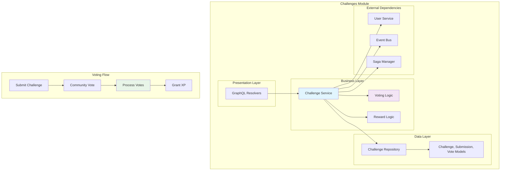

# Internal Challenges Module

Sistema completo de desafios e votação comunitária da plataforma LabEnd.

## 📋 Características

- **Challenge Management** completo (criar, listar)
- **Submission System** com provas via URL
- **Community Voting** para validação
- **Automated Processing** baseado em votos
- **XP Rewards** automáticos para aprovados
- **Anti-Fraud** com timeCheck e validações

## 🏗️ Arquitetura



## 🎯 Fluxo de Challenge

### 1. Criação de Challenge
```graphql
mutation {
  createChallenge(input: {
    title: "Aprender Go"
    description: "Complete um projeto em Go e compartilhe no GitHub"
    xpReward: 100
  }) {
    id
    title
    description
    xpReward
    createdAt
  }
}
```

### 2. Submissão do Usuário
```graphql
mutation {
  submitChallenge(input: {
    challengeID: "1"
    proofURL: "https://github.com/user/meu-projeto-go"
  }) {
    id
    proofURL
    status
    createdAt
  }
}
```

### 3. Votação da Comunidade
```graphql
mutation {
  voteOnSubmission(input: {
    submissionID: "1"
    approved: true
    timeCheck: 3500  # Tempo em ms para detectar bots
  }) {
    id
    approved
    timeCheck
    createdAt
  }
}
```

## 🗳️ Sistema de Votação

### Regras de Votação
- **Mínimo de 10 votos** para decisão
- **Maioria simples** para aprovação (> 50%)
- **TimeCheck** para detectar votação automática
- **Anti-duplicação** - usuário vota apenas 1x por submissão
- **Anti-auto-voto** - usuário não pode votar na própria submissão

### Processamento Automático
```go
func (s *service) processVotingResult(ctx context.Context, submission *ChallengeSubmission) {
    votes, err := s.repo.GetVotesBySubmissionID(ctx, submission.ID)
    if err != nil {
        s.logger.Error("Failed to get votes", zap.Error(err))
        return
    }
    
    // Verificar se tem votos suficientes
    if len(votes) < s.minVotesRequired {
        return // Ainda não tem votos suficientes
    }
    
    // Contar votos aprovados
    approved := 0
    for _, vote := range votes {
        if vote.Approved {
            approved++
        }
    }
    
    // Decidir baseado na maioria
    if approved > len(votes)/2 {
        s.approveSubmission(ctx, submission)
    } else {
        s.rejectSubmission(ctx, submission)
    }
}
```

## 🎁 Sistema de Recompensas

### Aprovação Automática
```go
func (s *service) approveSubmission(ctx context.Context, submission *ChallengeSubmission) {
    // Usar Saga para transação distribuída
    sagaData := map[string]interface{}{
        "submissionID": submission.ID,
        "userID":      submission.UserID,
        "challengeID": submission.ChallengeID,
        "xpAmount":    submission.Challenge.XPReward,
    }
    
    err := s.sagaManager.ExecuteSaga(ctx, "ApproveSubmissionSaga", sagaData)
    if err != nil {
        s.logger.Error("Failed to execute approval saga", zap.Error(err))
        return
    }
    
    // Publicar evento
    s.eventBus.Publish(eventbus.Event{
        Type:   "ChallengeApproved",
        Source: "challenges",
        Data: map[string]interface{}{
            "submissionID": submission.ID,
            "userID":      submission.UserID,
            "xpAwarded":   submission.Challenge.XPReward,
        },
    })
}
```

## 📊 Queries Otimizadas

### Listar Challenges
```graphql
query {
  challenges {
    id
    title
    description
    xpReward
    submissionsCount
    createdAt
  }
}
```

### Challenge com Submissões
```graphql
query {
  challenge(id: "1") {
    id
    title
    description
    xpReward
    submissions {
      id
      user {
        id
        name
      }
      proofURL
      status
      votesCount
      approvedVotes
    }
  }
}
```

## 🧪 Testes

### Teste de Votação
```go
func TestChallengeService_VoteOnSubmission(t *testing.T) {
    // Setup
    mockRepo := mocks.NewMockRepository(ctrl)
    mockUserService := mocks.NewMockUserService(ctrl)
    mockEventBus := mocks.NewMockEventBus(ctrl)
    
    service := challenges.NewService(mockRepo, mockUserService, logger, mockEventBus, txManager, sagaManager)
    
    // Mock submission
    submission := &challenges.ChallengeSubmission{
        ID:          1,
        UserID:      100,
        ChallengeID: 1,
        Status:      "pending",
    }
    
    // Mock expectations
    mockRepo.EXPECT().
        GetSubmissionByID(gomock.Any(), uint(1)).
        Return(submission, nil)
    
    mockRepo.EXPECT().
        GetVoteByUserAndSubmission(gomock.Any(), uint(200), uint(1)).
        Return(nil, gorm.ErrRecordNotFound)
    
    mockRepo.EXPECT().
        CreateVote(gomock.Any(), gomock.Any()).
        Return(&challenges.ChallengeVote{ID: 1, Approved: true}, nil)
    
    // Execute
    vote, err := service.VoteOnSubmission(ctx, 200, challenges.VoteChallengeInput{
        SubmissionID: "1",
        Approved:     true,
        TimeCheck:    3000,
    })
    
    // Assert
    assert.NoError(t, err)
    assert.True(t, vote.Approved)
}
```

### Teste de Processamento
```go
func TestChallengeService_ProcessVoting(t *testing.T) {
    // Criar submissão com 10 votos (7 aprovados, 3 rejeitados)
    submission := createTestSubmission(t)
    votes := createTestVotes(t, submission.ID, 7, 3)
    
    // Mock expectations
    mockRepo.EXPECT().
        GetVotesBySubmissionID(gomock.Any(), submission.ID).
        Return(votes, nil)
    
    mockRepo.EXPECT().
        UpdateSubmissionStatus(gomock.Any(), submission.ID, "approved").
        Return(nil)
    
    // Execute
    service.processVotingResult(ctx, submission)
    
    // Verificar se foi aprovado (7/10 > 50%)
    // Verificar se XP foi concedido
    // Verificar se evento foi publicado
}
```

## 📡 Eventos Publicados

### ChallengeCreated
```go
event := eventbus.Event{
    Type:   "ChallengeCreated",
    Source: "challenges",
    Data: map[string]interface{}{
        "challengeID": challenge.ID,
        "title":       challenge.Title,
        "xpReward":    challenge.XPReward,
    },
}
```

### ChallengeSubmitted
```go
event := eventbus.Event{
    Type:   "ChallengeSubmitted",
    Source: "challenges",
    Data: map[string]interface{}{
        "submissionID": submission.ID,
        "challengeID":  submission.ChallengeID,
        "userID":       submission.UserID,
        "proofURL":     submission.ProofURL,
    },
}
```

### ChallengeApproved
```go
event := eventbus.Event{
    Type:   "ChallengeApproved",
    Source: "challenges",
    Data: map[string]interface{}{
        "submissionID": submission.ID,
        "userID":       submission.UserID,
        "challengeID":  submission.ChallengeID,
        "xpAwarded":    challenge.XPReward,
    },
}
```

## 🔧 Configuração

### Parâmetros do Sistema
```go
type Config struct {
    MinVotesRequired    int `env:"MIN_VOTES_REQUIRED" default:"10"`
    MinVotingTimeSecond int `env:"MIN_VOTING_TIME_SECONDS" default:"60"`
    MaxSubmissionsUser  int `env:"MAX_SUBMISSIONS_PER_USER" default:"1"`
}
```

### Inicialização
```go
// Setup dependencies
challengeRepo := challenges.NewRepository(db)
challengeService := challenges.NewService(
    challengeRepo, 
    userService, 
    logger, 
    eventBus, 
    txManager, 
    sagaManager,
)

// GraphQL registration
challengeQueries := challenges.Queries(challengeService, logger)
challengeMutations := challenges.Mutations(challengeService, logger)
```

## 📈 Métricas

### Métricas Importantes
- **Challenges Created**: Total de challenges criados
- **Submissions**: Total de submissões
- **Votes Cast**: Total de votos
- **Approval Rate**: Taxa de aprovação
- **Average Voting Time**: Tempo médio de votação

### Anti-Fraud Metrics
- **Fast Votes**: Votos muito rápidos (possíveis bots)
- **Suspicious Patterns**: Padrões suspeitos de votação
- **Auto-vote Attempts**: Tentativas de auto-voto

## 🛡️ Segurança

### Validações Implementadas
- **Submissão única** por usuário por challenge
- **Voto único** por usuário por submissão
- **Anti-auto-voto** - usuário não vota em si mesmo
- **TimeCheck** para detectar automação
- **URL validation** para proofURL

### Exemplo de Validação
```go
func (s *service) validateVote(ctx context.Context, userID uint, submissionID uint) error {
    // Verificar se usuário já votou
    _, err := s.repo.GetVoteByUserAndSubmission(ctx, userID, submissionID)
    if err == nil {
        return errors.New("user already voted on this submission")
    }
    
    // Verificar se é auto-voto
    submission, err := s.repo.GetSubmissionByID(ctx, submissionID)
    if err != nil {
        return err
    }
    
    if submission.UserID == userID {
        return errors.New("user cannot vote on own submission")
    }
    
    return nil
}
```

## 🔗 Dependências

```go
require (
    gorm.io/gorm v1.25.5
    github.com/graphql-go/graphql v0.8.1
    go.uber.org/zap v1.26.0
)
```

---

**Internal Challenges Module** implementa o sistema completo de desafios da aplicação LabEnd, com votação comunitária e recompensas automáticas. 