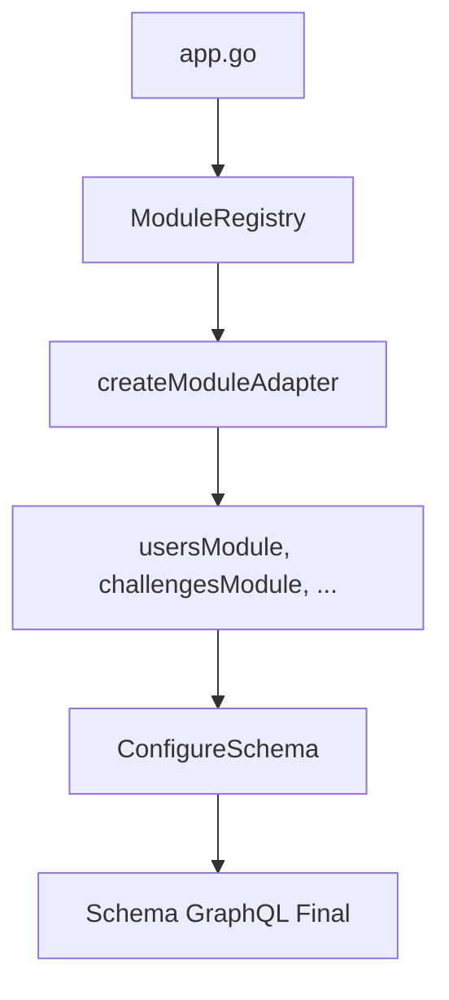

# 📁 Estrutura Organizada do GraphQL Schema

O módulo GraphQL foi dividido em arquivos mais organizados e com responsabilidades bem definidas.

## 🗂️ **Estrutura dos Arquivos**

```
internal/config/graphql/
├── registry.go          # 🏭 ModuleRegistry e gerenciamento de módulos
├── adapters.go          # 🔌 Adapters para conectar módulos ao GraphQL
├── configure_schema.go  # ⚙️  Configuração principal do schema
├── example_usage.go     # 📝 Exemplo de como usar
├── REGISTRO_MODULES.md  # 📖 Documentação do sistema
├── EXEMPLO_USO.md       # 💡 Exemplo prático
└── README.md           # 📋 Este arquivo
```

## 📋 **Responsabilidades de Cada Arquivo**

### **1. `registry.go` - Registry de Módulos**
- Interface `ModuleGraphQL`
- Struct `ModuleRegistry` com métodos Register/Get
- Lista `registeredModules` (onde você adiciona módulos)
- Funções auxiliares do registry

### **2. `adapters.go` - Adapters dos Módulos**
- Função `createModuleAdapter()` (factory dos adapters)
- Structs dos adapters (`usersModule`, `challengesModule`, etc.)
- Implementações das interfaces GraphQL

### **3. `configure_schema.go` - Configuração Principal**
- Função `ConfigureSchema()` (entry point principal)
- Funções `configQueries()` e `configureMutations()`
- Lógica de combinação de queries/mutations

## 🎯 **Como Adicionar um Novo Módulo**

### **1. Gerar o módulo:**
```bash
make generate-module MODULE=products
```

### **2. Registrar em `registry.go`:**
```go
var registeredModules = []string{
	"users",
	"challenges",
	"products",  // ← SÓ ADICIONE ESTA LINHA
}
```

### **3. Adicionar adapter em `adapters.go`:**
```go
// No import
"github.com/rafaelcoelhox/labbend/internal/products"

// No switch da função createModuleAdapter
case "products":
	if productService, ok := service.(products.Service); ok {
		return &productsModule{service: productService}
	}

// No final do arquivo
type productsModule struct {
	service products.Service
}

func (m *productsModule) Queries(logger logger.Logger) *graphql.Fields {
	return products.Queries(m.service, logger)
}

func (m *productsModule) Mutations(logger logger.Logger) *graphql.Fields {
	return products.Mutations(m.service, logger)
}
```

### **4. Usar no `app.go`:**
```go
registry.Register("products", productService)
```

## 🚀 **Benefícios da Nova Estrutura**

- ✅ **Separação de responsabilidades** - cada arquivo tem função específica
- ✅ **Fácil manutenção** - mudanças ficam isoladas
- ✅ **Código limpo** - arquivos menores e focados
- ✅ **Escalabilidade** - fácil adicionar novos módulos
- ✅ **Legibilidade** - estrutura clara e organizada

## 📖 **Fluxo de Funcionamento**

1. **Registry** gerencia módulos registrados
2. **Adapters** convertem services em interfaces GraphQL
3. **Configure Schema** combina tudo em um schema final



## 💡 **Próximos Passos**

Para melhorar ainda mais, você pode:
- Adicionar validações nos adapters
- Criar testes unitários para cada arquivo
- Implementar hot-reload de módulos
- Adicionar métricas de performance 