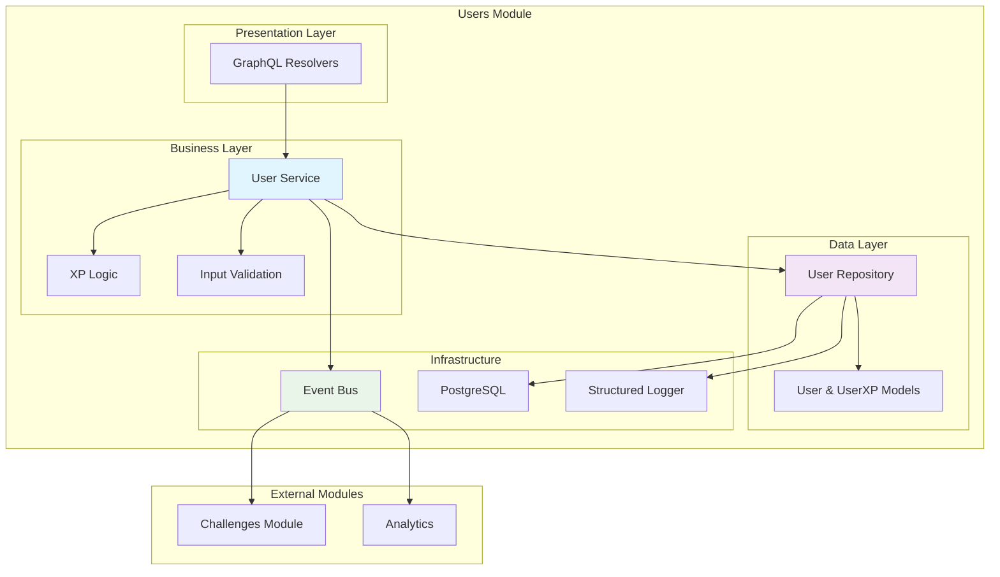

# Internal Users Module

Módulo completo para gerenciamento de usuários e sistema de XP (experiência) na plataforma LabEnd.

## 📋 Características

- **User Management** completo (CRUD)
- **XP System** para gamificação
- **Query Optimization** com JOIN para eliminar N+1
- **Event Publishing** para comunicação entre módulos
- **GraphQL API** funcional
- **Integration Tests** com Testcontainers

## 🏗️ Arquitetura



## 🚀 Uso da API

### GraphQL Queries

#### Listar Usuários com XP
```graphql
query {
  users {
    id
    name
    email
    totalXP
    createdAt
  }
}
```

#### Buscar Usuário Específico
```graphql
query {
  user(id: "1") {
    id
    name
    email
    totalXP
    xpHistory {
      amount
      sourceType
      sourceId
      createdAt
    }
  }
}
```

### GraphQL Mutations

#### Criar Usuário
```graphql
mutation {
  createUser(input: {
    name: "João Silva"
    email: "joao@exemplo.com"
  }) {
    id
    name
    email
    createdAt
  }
}
```

#### Atualizar Usuário
```graphql
mutation {
  updateUser(id: "1", input: {
    name: "João Silva Santos"
  }) {
    id
    name
    email
    updatedAt
  }
}
```

#### Dar XP ao Usuário
```graphql
mutation {
  giveUserXP(input: {
    userID: "1"
    sourceType: "challenge"
    sourceID: "123"
    amount: 100
  }) {
    success
    message
  }
}
```

## 🎮 Sistema de XP

### Tipos de XP Source
- `challenge` - XP por completar challenges
- `vote` - XP por votar em submissões
- `daily_login` - XP por login diário
- `profile_complete` - XP por completar perfil

### Exemplo de Concessão de XP
```go
// Dar XP por completar challenge
err := userService.GiveUserXP(ctx, userID, "challenge", "123", 100)

// Dar XP dentro de transação
err := txManager.WithTransaction(ctx, func(tx *gorm.DB) error {
    return userService.GiveUserXPWithTx(ctx, tx, userID, "challenge", "123", 100)
})
```

## 📊 Otimizações de Performance

### Query JOIN Otimizada
```sql
-- Query N+1 eliminada
SELECT users.*, COALESCE(SUM(user_xp.amount), 0) as total_xp 
FROM users 
LEFT JOIN user_xp ON users.id = user_xp.user_id 
GROUP BY users.id 
ORDER BY users.created_at DESC;
```

### Índices Estratégicos
```sql
-- users table
CREATE INDEX idx_users_email ON users(email);
CREATE INDEX idx_users_name ON users(name);
CREATE INDEX idx_users_created_at ON users(created_at);
CREATE INDEX idx_users_deleted_at ON users(deleted_at);

-- user_xp table  
CREATE INDEX idx_user_xp_user_id ON user_xp(user_id);
CREATE INDEX idx_user_xp_source ON user_xp(source_type, source_id);
CREATE INDEX idx_user_xp_created_at ON user_xp(created_at);
```

## 📡 Eventos Publicados

### UserCreated
```go
event := eventbus.Event{
    Type:   "UserCreated",
    Source: "users",
    Data: map[string]interface{}{
        "userID": user.ID,
        "email":  user.Email,
        "name":   user.Name,
    },
}
```

### UserUpdated
```go
event := eventbus.Event{
    Type:   "UserUpdated", 
    Source: "users",
    Data: map[string]interface{}{
        "userID": user.ID,
        "changes": changedFields,
    },
}
```

### UserXPGranted
```go
event := eventbus.Event{
    Type:   "UserXPGranted",
    Source: "users", 
    Data: map[string]interface{}{
        "userID":     userID,
        "amount":     amount,
        "sourceType": sourceType,
        "sourceID":   sourceID,
        "totalXP":    newTotalXP,
    },
}
```

## 🧪 Testes

### Testes Unitários
```bash
# Executar testes unitários
go test ./internal/users -v -run "Test.*Service"

# Com coverage
go test ./internal/users -coverprofile=coverage.out
go tool cover -html=coverage.out
```

### Testes de Integração
```bash
# Testes com PostgreSQL via Testcontainers
go test ./internal/users -v -run "TestUserRepository_Integration"

# Teste específico
go test ./internal/users -v -run "TestUserRepository_Integration_Create"
```

### Exemplo de Teste
```go
func TestUserService_CreateUser(t *testing.T) {
    // Setup
    mockRepo := mocks.NewMockRepository(ctrl)
    mockEventBus := mocks.NewMockEventBus(ctrl)
    mockLogger := mocks.NewMockLogger(ctrl)
    
    service := users.NewService(mockRepo, mockLogger, mockEventBus, txManager)
    
    // Mock expectations
    mockRepo.EXPECT().
        Create(gomock.Any(), gomock.Any()).
        Return(&users.User{ID: 1, Name: "Test", Email: "test@test.com"}, nil)
    
    mockEventBus.EXPECT().
        Publish(gomock.Any()).
        Times(1)
    
    // Execute
    user, err := service.CreateUser(ctx, users.CreateUserInput{
        Name:  "Test",
        Email: "test@test.com",
    })
    
    // Assert
    assert.NoError(t, err)
    assert.Equal(t, "Test", user.Name)
}
```

## 🏗️ Estrutura de Arquivos

```
internal/users/
├── doc.go              # Documentação do módulo
├── model.go            # Estruturas User e UserXP
├── repository.go       # Data access layer
├── service.go          # Business logic layer
├── graphql.go          # GraphQL resolvers
├── service_test.go     # Unit tests
├── repository_integration_test.go  # Integration tests
└── README.md           # Este arquivo
```

## 🔧 Configuração

### Dependências do Módulo
```go
type Service interface {
    CreateUser(ctx context.Context, input CreateUserInput) (*User, error)
    GetUser(ctx context.Context, id uint) (*User, error)
    GetUserWithXP(ctx context.Context, id uint) (*UserWithXP, error)
    UpdateUser(ctx context.Context, id uint, input UpdateUserInput) (*User, error)
    DeleteUser(ctx context.Context, id uint) error
    ListUsers(ctx context.Context, limit, offset int) ([]*User, error)
    ListUsersWithXP(ctx context.Context, limit, offset int) ([]*UserWithXP, error)
    
    // XP methods
    GiveUserXP(ctx context.Context, userID uint, sourceType, sourceID string, amount int) error
    GetUserTotalXP(ctx context.Context, userID uint) (int, error)
    GetUserXPHistory(ctx context.Context, userID uint) ([]*UserXP, error)
}
```

### Inicialização do Módulo
```go
// Setup no main.go ou app.go
userRepo := users.NewRepository(db)
userService := users.NewService(userRepo, logger, eventBus, txManager)

// GraphQL schema registration
userQueries := users.Queries(userService, logger)
userMutations := users.Mutations(userService, logger)
```

## 📈 Métricas

### Métricas Importantes
- **Users Created**: Total de usuários criados
- **XP Granted**: Total de XP concedido
- **Query Performance**: Tempo de queries de usuário
- **Event Publishing**: Taxa de eventos publicados

### Exemplo de Coleta
```go
func (s *service) CreateUser(ctx context.Context, input CreateUserInput) (*User, error) {
    start := time.Now()
    defer func() {
        metrics.ObserveDuration("user_create_duration", time.Since(start))
    }()
    
    user, err := s.repo.Create(ctx, input)
    if err != nil {
        metrics.IncrementCounter("user_create_errors")
        return nil, err
    }
    
    metrics.IncrementCounter("users_created_total")
    return user, nil
}
```

## 🔗 Dependências

```go
require (
    gorm.io/gorm v1.25.5
    github.com/graphql-go/graphql v0.8.1
    go.uber.org/zap v1.26.0
)
```

---

**Internal Users Module** é o núcleo do sistema de usuários da aplicação LabEnd, fornecendo gestão completa de usuários e sistema de gamificação com XP. 