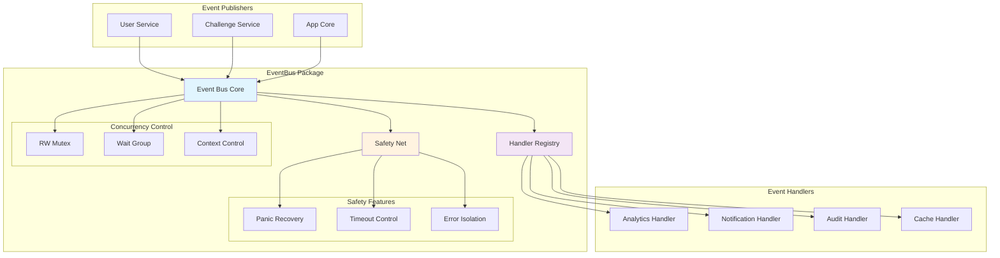
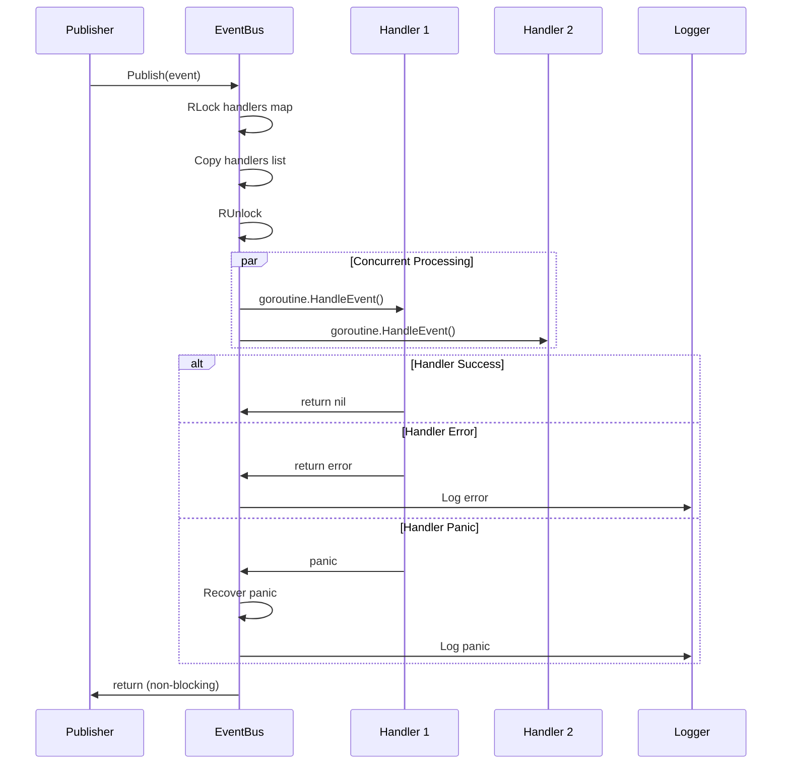

# Package EventBus

Sistema de eventos thread-safe em memória para comunicação assíncrona entre módulos da aplicação LabEnd.

## 📋 Características

- **Thread-Safe** com sync.RWMutex para leitura/escrita
- **Processamento Assíncrono** em goroutines isoladas
- **Graceful Shutdown** com timeout protection
- **Panic Recovery** automática em handlers
- **Isolation de Erros** - falha em um handler não afeta outros
- **Timeout Protection** para handlers lentos
- **Structured Logging** integrado

## 🏗️ Arquitetura



## 🚀 Uso Básico

### Criando Event Bus
```go
logger, _ := logger.NewDevelopment()
eventBus := eventbus.New(logger)
defer eventBus.Shutdown()
```

### Definindo Handler
```go
type MyHandler struct {
    name string
}

func (h *MyHandler) HandleEvent(ctx context.Context, event eventbus.Event) error {
    fmt.Printf("Handler %s processando %s\n", h.name, event.Type)
    
    // Processar evento
    userID := event.Data["userID"].(int)
    email := event.Data["email"].(string)
    
    // Lógica do handler
    return nil
}
```

### Subscrevendo Handler
```go
handler := &MyHandler{name: "analytics"}
eventBus.Subscribe("UserCreated", handler)
eventBus.Subscribe("UserUpdated", handler)
```

### Publicando Eventos
```go
// Evento simples
eventBus.Publish(eventbus.Event{
    Type:   "UserCreated",
    Source: "users",
    Data: map[string]interface{}{
        "userID": 123,
        "email":  "user@example.com",
        "name":   "João Silva",
    },
})

// Com transação (implementação básica)
err := eventBus.PublishWithTx(ctx, tx, eventbus.Event{
    Type:   "XPGranted",
    Source: "challenges",
    Data: map[string]interface{}{
        "userID": 123,
        "amount": 100,
        "source": "challenge_completed",
    },
})
```

## 🔄 Fluxo de Eventos



## ⚙️ Configuração Avançada

### Handler com Timeout Customizado
```go
type TimedHandler struct {
    timeout time.Duration
}

func (h *TimedHandler) HandleEvent(ctx context.Context, event eventbus.Event) error {
    // Adicionar timeout específico
    ctx, cancel := context.WithTimeout(ctx, h.timeout)
    defer cancel()
    
    // Processar com timeout
    select {
    case <-ctx.Done():
        return ctx.Err()
    case result := <-h.processEvent(event):
        return result
    }
}
```

### Handler com Retry
```go
type RetryHandler struct {
    maxRetries int
}

func (h *RetryHandler) HandleEvent(ctx context.Context, event eventbus.Event) error {
    var lastErr error
    
    for i := 0; i < h.maxRetries; i++ {
        if err := h.tryProcess(ctx, event); err != nil {
            lastErr = err
            time.Sleep(time.Millisecond * time.Duration(100*(i+1)))
            continue
        }
        return nil
    }
    
    return fmt.Errorf("failed after %d retries: %w", h.maxRetries, lastErr)
}
```

## 🛡️ Safety Features

### Panic Recovery
```go
// O EventBus automaticamente recupera panics
defer func() {
    if r := recover(); r != nil {
        eb.logger.Error("handler panicked", 
            zap.String("handler", getHandlerName(h)),
            zap.String("event_type", event.Type),
            zap.Any("panic", r))
    }
}()
```

### Error Isolation
```go
// Erros em um handler não afetam outros
if err := h.HandleEvent(eb.ctx, event); err != nil {
    eb.logger.Error("handler failed", 
        zap.String("handler", getHandlerName(h)),
        zap.String("event_type", event.Type),
        zap.Error(err))
    // Continua processando outros handlers
}
```

### Timeout Protection
```go
// Cada handler tem context com timeout automático
ctx, cancel := context.WithTimeout(eb.ctx, 30*time.Second)
defer cancel()

if err := h.HandleEvent(ctx, event); err != nil {
    // Log timeout ou outro erro
}
```

## 🧪 Testes

### Mock Handler para Testes
```go
type MockHandler struct {
    events []eventbus.Event
    errors []error
    mu     sync.Mutex
}

func (m *MockHandler) HandleEvent(ctx context.Context, event eventbus.Event) error {
    m.mu.Lock()
    defer m.mu.Unlock()
    
    m.events = append(m.events, event)
    
    if len(m.errors) > 0 {
        err := m.errors[0]
        m.errors = m.errors[1:]
        return err
    }
    
    return nil
}

func (m *MockHandler) GetEvents() []eventbus.Event {
    m.mu.Lock()
    defer m.mu.Unlock()
    return append([]eventbus.Event{}, m.events...)
}
```

### Teste de Publicação
```go
func TestEventBusPublish(t *testing.T) {
    logger, _ := logger.NewDevelopment()
    eventBus := eventbus.New(logger)
    defer eventBus.Shutdown()
    
    mock := &MockHandler{}
    eventBus.Subscribe("TestEvent", mock)
    
    // Publicar evento
    eventBus.Publish(eventbus.Event{
        Type:   "TestEvent",
        Source: "test",
        Data:   map[string]interface{}{"key": "value"},
    })
    
    // Aguardar processamento
    time.Sleep(100 * time.Millisecond)
    
    // Verificar
    events := mock.GetEvents()
    assert.Len(t, events, 1)
    assert.Equal(t, "TestEvent", events[0].Type)
}
```

## 📊 Performance

### Características
- **Lock Contention Mínimo**: RLock permite múltiplos leitores
- **Handler Isolation**: Falha não impacta performance
- **Memory Efficient**: Cópia de handlers para evitar locks longos
- **Async Processing**: Não bloqueia publisher

### Benchmarks
```go
func BenchmarkEventBusPublish(b *testing.B) {
    logger, _ := logger.NewDevelopment()
    eventBus := eventbus.New(logger)
    defer eventBus.Shutdown()
    
    handler := &NoOpHandler{}
    eventBus.Subscribe("BenchEvent", handler)
    
    event := eventbus.Event{
        Type:   "BenchEvent",
        Source: "benchmark",
        Data:   map[string]interface{}{"id": 1},
    }
    
    b.ResetTimer()
    for i := 0; i < b.N; i++ {
        eventBus.Publish(event)
    }
}
```

## 🔍 Monitoring

### Logs Estruturados
```json
{
  "level": "info",
  "timestamp": "2025-01-13T10:00:00Z",
  "caller": "eventbus/eventbus.go:75",
  "msg": "Event published",
  "event_type": "UserCreated",
  "event_source": "users",
  "handlers_count": 3
}
```

### Health Check
```go
type EventBusChecker struct {
    eventBus *eventbus.EventBus
}

func (c *EventBusChecker) Check(ctx context.Context) *health.Check {
    // Verificar se event bus está responsivo
    testEvent := eventbus.Event{
        Type:   "HealthCheck",
        Source: "health",
        Data:   map[string]interface{}{"timestamp": time.Now()},
    }
    
    start := time.Now()
    c.eventBus.Publish(testEvent)
    duration := time.Since(start)
    
    return &health.Check{
        Name:     "eventbus",
        Status:   health.StatusHealthy,
        Duration: duration,
    }
}
```

## 🚦 Graceful Shutdown

```go
func (eb *EventBus) Shutdown() {
    eb.logger.Info("shutting down event bus")
    
    // 1. Cancelar context principal
    eb.cancel()
    
    // 2. Aguardar todos handlers terminarem
    done := make(chan struct{})
    go func() {
        eb.wg.Wait()
        close(done)
    }()
    
    // 3. Timeout de 30 segundos
    select {
    case <-done:
        eb.logger.Info("event bus shutdown complete")
    case <-time.After(30 * time.Second):
        eb.logger.Warn("event bus shutdown timed out")
    }
}
```

## 💡 Padrões de Uso

### Event Sourcing
```go
type EventStore struct {
    eventBus *eventbus.EventBus
    storage  []eventbus.Event
}

func (es *EventStore) HandleEvent(ctx context.Context, event eventbus.Event) error {
    // Armazenar evento para replay
    es.storage = append(es.storage, event)
    
    // Processar side effects
    return es.processEvent(ctx, event)
}
```

### Saga Pattern
```go
type SagaHandler struct {
    txManager *database.TxManager
}

func (s *SagaHandler) HandleEvent(ctx context.Context, event eventbus.Event) error {
    switch event.Type {
    case "UserCreated":
        return s.handleUserCreated(ctx, event)
    case "ChallengeCompleted":
        return s.handleChallengeCompleted(ctx, event)
    }
    return nil
}
```

## 🔗 Dependências

```go
require (
    go.uber.org/zap v1.26.0
)
```

## 📚 Referências

- [Go Concurrency Patterns](https://golang.org/doc/effective_go#concurrency)
- [Event-Driven Architecture](https://microservices.io/patterns/data/event-driven-architecture.html)
- [Graceful Shutdown Pattern](https://pkg.go.dev/context)

---

**Package eventbus** é o sistema nervoso da aplicação LabEnd, permitindo comunicação assíncrona robusta e desacoplada entre módulos. 