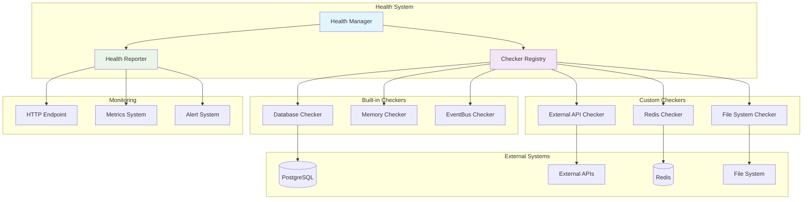

# Package Health

Sistema de health checks para monitoramento da saúde dos componentes da aplicação LabEnd.

## 📋 Características

- **Health Checks** para componentes críticos
- **Status Aggregation** com relatórios detalhados
- **Timeout Protection** para evitar travamentos
- **Extensível** via interface Checker
- **Monitoring Ready** para integração com ferramentas
- **Uptime Tracking** automático

## 🏗️ Arquitetura



## 🚀 Uso Básico

### Criando Health Manager
```go
manager := health.NewManager()
```

### Registrando Checkers
```go
// Database checker
manager.Register("database", health.NewDatabaseChecker(db))

// Memory checker
manager.Register("memory", health.NewMemoryChecker())

// EventBus checker
manager.Register("eventbus", health.NewEventBusChecker(eventBus))
```

### Executando Health Checks
```go
// Check individual
ctx := context.Background()
report := manager.CheckAll(ctx)

fmt.Printf("Status: %s\n", report.Status)
fmt.Printf("Uptime: %s\n", report.Uptime)

for name, check := range report.Checks {
    fmt.Printf("%s: %s (%dms)\n", 
        name, check.Status, check.Duration.Milliseconds())
}
```

## 📊 Status Types

```go
const (
    StatusHealthy   Status = "healthy"
    StatusUnhealthy Status = "unhealthy"
    StatusDegraded  Status = "degraded"
)
```

## 🔍 Built-in Checkers

### Database Checker
```go
checker := health.NewDatabaseChecker(db)

// Verifica:
// - Conectividade com ping
// - Latência da conexão
// - Pool de conexões disponível
```

### Memory Checker
```go
checker := health.NewMemoryChecker()

// Verifica:
// - Uso de memória atual
// - GC statistics
// - Memory pressure
```

### EventBus Checker
```go
checker := health.NewEventBusChecker(eventBus)

// Verifica:
// - Event bus responsividade
// - Handler registration
// - Queue health
```

## 🛠️ Custom Checkers

### Criando Checker Customizado
```go
type RedisChecker struct {
    client redis.Client
}

func (c *RedisChecker) Check(ctx context.Context) *health.Check {
    start := time.Now()
    
    // Test Redis ping
    _, err := c.client.Ping(ctx).Result()
    duration := time.Since(start)
    
    if err != nil {
        return &health.Check{
            Name:      "redis",
            Status:    health.StatusUnhealthy,
            Message:   err.Error(),
            Duration:  duration,
            Timestamp: start,
        }
    }
    
    return &health.Check{
        Name:      "redis",
        Status:    health.StatusHealthy,
        Duration:  duration,
        Timestamp: start,
    }
}
```

### HTTP API Checker
```go
type APIChecker struct {
    url    string
    client *http.Client
}

func (c *APIChecker) Check(ctx context.Context) *health.Check {
    start := time.Now()
    
    req, _ := http.NewRequestWithContext(ctx, "GET", c.url, nil)
    resp, err := c.client.Do(req)
    duration := time.Since(start)
    
    if err != nil || resp.StatusCode >= 500 {
        status := health.StatusUnhealthy
        message := "API unavailable"
        if err != nil {
            message = err.Error()
        }
        
        return &health.Check{
            Name:      "external_api",
            Status:    status,
            Message:   message,
            Duration:  duration,
            Timestamp: start,
        }
    }
    
    // Check for degraded performance
    status := health.StatusHealthy
    if duration > 2*time.Second {
        status = health.StatusDegraded
    }
    
    return &health.Check{
        Name:      "external_api",
        Status:    status,
        Duration:  duration,
        Timestamp: start,
    }
}
```

## 🌐 HTTP Integration

### Endpoint de Health Check
```go
func healthHandler(manager *health.Manager) gin.HandlerFunc {
    return func(c *gin.Context) {
        ctx, cancel := context.WithTimeout(c.Request.Context(), 5*time.Second)
        defer cancel()
        
        report := manager.CheckAll(ctx)
        
        statusCode := http.StatusOK
        if report.Status == health.StatusUnhealthy {
            statusCode = http.StatusServiceUnavailable
        } else if report.Status == health.StatusDegraded {
            statusCode = http.StatusPartialContent
        }
        
        c.JSON(statusCode, report)
    }
}

// Registrar rota
router.GET("/health", healthHandler(manager))
```

### Exemplo de Response
```json
{
  "status": "healthy",
  "timestamp": "2025-01-13T10:00:00Z",
  "uptime": 3600,
  "checks": {
    "database": {
      "name": "database",
      "status": "healthy",
      "duration": 15,
      "timestamp": "2025-01-13T10:00:00Z"
    },
    "memory": {
      "name": "memory", 
      "status": "healthy",
      "duration": 1,
      "timestamp": "2025-01-13T10:00:00Z"
    },
    "eventbus": {
      "name": "eventbus",
      "status": "degraded",
      "message": "high latency detected",
      "duration": 250,
      "timestamp": "2025-01-13T10:00:00Z"
    }
  }
}
```

## 🔄 Health Check Strategies

### Timeout Strategy
```go
type TimeoutChecker struct {
    checker Checker
    timeout time.Duration
}

func (tc *TimeoutChecker) Check(ctx context.Context) *health.Check {
    ctx, cancel := context.WithTimeout(ctx, tc.timeout)
    defer cancel()
    
    done := make(chan *health.Check, 1)
    go func() {
        done <- tc.checker.Check(ctx)
    }()
    
    select {
    case check := <-done:
        return check
    case <-ctx.Done():
        return &health.Check{
            Name:    "timeout_wrapper",
            Status:  health.StatusUnhealthy,
            Message: "health check timed out",
            Duration: tc.timeout,
        }
    }
}
```

### Circuit Breaker Strategy
```go
type CircuitBreakerChecker struct {
    checker      Checker
    failureCount int
    maxFailures  int
    resetTime    time.Time
}

func (cb *CircuitBreakerChecker) Check(ctx context.Context) *health.Check {
    // Se circuit está aberto
    if cb.failureCount >= cb.maxFailures && time.Now().Before(cb.resetTime) {
        return &health.Check{
            Name:    "circuit_breaker",
            Status:  health.StatusUnhealthy,
            Message: "circuit breaker open",
        }
    }
    
    check := cb.checker.Check(ctx)
    
    if check.Status == health.StatusUnhealthy {
        cb.failureCount++
        cb.resetTime = time.Now().Add(30 * time.Second)
    } else {
        cb.failureCount = 0
    }
    
    return check
}
```

## 🧪 Testes

### Mock Checker
```go
type MockChecker struct {
    status   health.Status
    duration time.Duration
    err      error
}

func (m *MockChecker) Check(ctx context.Context) *health.Check {
    time.Sleep(m.duration)
    
    check := &health.Check{
        Name:      "mock",
        Status:    m.status,
        Duration:  m.duration,
        Timestamp: time.Now(),
    }
    
    if m.err != nil {
        check.Message = m.err.Error()
    }
    
    return check
}
```

### Teste de Health Manager
```go
func TestHealthManager(t *testing.T) {
    manager := health.NewManager()
    
    // Registrar mock checkers
    manager.Register("healthy", &MockChecker{
        status:   health.StatusHealthy,
        duration: 10 * time.Millisecond,
    })
    
    manager.Register("unhealthy", &MockChecker{
        status:   health.StatusUnhealthy,
        duration: 5 * time.Millisecond,
        err:      errors.New("service down"),
    })
    
    // Executar checks
    report := manager.CheckAll(context.Background())
    
    // Verificar resultado
    assert.Equal(t, health.StatusUnhealthy, report.Status)
    assert.Len(t, report.Checks, 2)
    assert.Equal(t, "service down", report.Checks["unhealthy"].Message)
}
```

## 📈 Monitoring Integration

### Prometheus Metrics
```go
type MetricsReporter struct {
    healthDuration prometheus.HistogramVec
    healthStatus   prometheus.GaugeVec
}

func (m *MetricsReporter) ReportHealth(report *health.Report) {
    for name, check := range report.Checks {
        // Duration metric
        m.healthDuration.WithLabelValues(name).Observe(
            float64(check.Duration.Milliseconds()),
        )
        
        // Status metric (0=unhealthy, 1=degraded, 2=healthy)
        var statusValue float64
        switch check.Status {
        case health.StatusHealthy:
            statusValue = 2
        case health.StatusDegraded:
            statusValue = 1
        case health.StatusUnhealthy:
            statusValue = 0
        }
        
        m.healthStatus.WithLabelValues(name).Set(statusValue)
    }
}
```

### Alert Rules
```yaml
# alerts.yml
groups:
  - name: health_checks
    rules:
      - alert: ServiceUnhealthy
        expr: health_status < 2
        for: 1m
        labels:
          severity: critical
        annotations:
          summary: "Service {{ $labels.service }} is unhealthy"
          
      - alert: HealthCheckSlow
        expr: health_duration_seconds > 1
        for: 2m
        labels:
          severity: warning
        annotations:
          summary: "Health check for {{ $labels.service }} is slow"
```

## 🔗 Dependências

```go
// Nenhuma dependência externa - package standard
```

## 📚 Referências

- [Health Check API Pattern](https://microservices.io/patterns/observability/health-check-api.html)
- [Circuit Breaker Pattern](https://martinfowler.com/bliki/CircuitBreaker.html)
- [Prometheus Monitoring](https://prometheus.io/docs/concepts/)

---

**Package health** fornece uma base sólida para monitoramento proativo da saúde da aplicação LabEnd, permitindo detecção precoce de problemas e manutenção preventiva. 