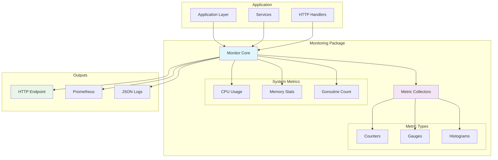

# Package Monitoring

Sistema de métricas e observabilidade para monitoramento de performance da aplicação LabEnd.

## 📋 Características

- **Métricas de Performance** em tempo real
- **System Metrics** (CPU, Memory, Goroutines)
- **Application Metrics** (Requests, Database, Events)
- **Structured Output** para integração com ferramentas
- **Thread-Safe** operations
- **Lightweight** com baixo overhead

## 🏗️ Arquitetura



## 🚀 Uso Básico

### Criando Monitor
```go
logger, _ := logger.NewDevelopment()
monitor := monitoring.NewMonitor(logger)
```

### Métricas Básicas
```go
// Incrementar contador
monitor.IncrementCounter("http_requests_total", map[string]string{
    "method": "GET",
    "path":   "/api/users",
    "status": "200",
})

// Definir gauge
monitor.SetGauge("active_connections", 42)

// Observar duração
start := time.Now()
// ... operação ...
monitor.ObserveDuration("request_duration", time.Since(start), map[string]string{
    "endpoint": "/api/users",
})
```

### Métricas de Sistema
```go
metrics := monitor.GetSystemMetrics()
fmt.Printf("CPU Usage: %.2f%%\n", metrics.CPUUsage)
fmt.Printf("Memory: %d MB\n", metrics.MemoryMB)
fmt.Printf("Goroutines: %d\n", metrics.Goroutines)
```

## 📊 Tipos de Métricas

### Counters
```go
// Total de requests HTTP
monitor.IncrementCounter("http_requests_total", map[string]string{
    "method": "POST",
    "path":   "/api/users",
})

// Erros por tipo
monitor.IncrementCounter("errors_total", map[string]string{
    "type": "database_error",
})

// Eventos processados
monitor.IncrementCounter("events_processed", map[string]string{
    "event_type": "UserCreated",
})
```

### Gauges
```go
// Conexões ativas
monitor.SetGauge("database_connections_active", 25)

// Cache hit rate
monitor.SetGauge("cache_hit_rate", 0.85)

// Queue size
monitor.SetGauge("event_queue_size", 150)
```

### Histograms/Durations
```go
// Database query times
monitor.ObserveDuration("database_query_duration", duration, map[string]string{
    "operation": "SELECT",
    "table":     "users",
})

// HTTP request times
monitor.ObserveDuration("http_request_duration", duration, map[string]string{
    "method":   "GET",
    "endpoint": "/api/users",
})
```

## 🔍 Implementação Avançada

### Custom Metrics Collector
```go
type DatabaseCollector struct {
    db *gorm.DB
}

func (d *DatabaseCollector) Collect() map[string]interface{} {
    sqlDB, _ := d.db.DB()
    stats := sqlDB.Stats()
    
    return map[string]interface{}{
        "open_connections":    stats.OpenConnections,
        "in_use":             stats.InUse,
        "idle":               stats.Idle,
        "wait_count":         stats.WaitCount,
        "wait_duration":      stats.WaitDuration.Milliseconds(),
        "max_idle_closed":    stats.MaxIdleClosed,
        "max_lifetime_closed": stats.MaxLifetimeClosed,
    }
}

// Registrar collector
monitor.RegisterCollector("database", &DatabaseCollector{db: db})
```

### Middleware para HTTP
```go
func MetricsMiddleware(monitor *monitoring.Monitor) gin.HandlerFunc {
    return func(c *gin.Context) {
        start := time.Now()
        
        // Incrementar requests
        monitor.IncrementCounter("http_requests_total", map[string]string{
            "method": c.Request.Method,
            "path":   c.FullPath(),
        })
        
        // Continuar processamento
        c.Next()
        
        // Observar duração
        duration := time.Since(start)
        monitor.ObserveDuration("http_request_duration", duration, map[string]string{
            "method": c.Request.Method,
            "path":   c.FullPath(),
            "status": fmt.Sprintf("%d", c.Writer.Status()),
        })
    }
}
```

## 🌐 HTTP Endpoint

### Configurando Endpoint
```go
func metricsHandler(monitor *monitoring.Monitor) gin.HandlerFunc {
    return func(c *gin.Context) {
        metrics := monitor.GetAllMetrics()
        c.JSON(http.StatusOK, metrics)
    }
}

router.GET("/metrics", metricsHandler(monitor))
```

### Exemplo de Response
```json
{
  "timestamp": "2025-01-13T10:00:00Z",
  "uptime_seconds": 3600,
  "system": {
    "cpu_usage_percent": 45.2,
    "memory_mb": 256,
    "memory_percent": 12.8,
    "goroutines": 25,
    "gc_cycles": 150
  },
  "counters": {
    "http_requests_total": {
      "GET:/api/users": 1250,
      "POST:/api/users": 85,
      "GET:/api/challenges": 760
    },
    "events_processed": {
      "UserCreated": 85,
      "ChallengeCompleted": 45
    }
  },
  "gauges": {
    "database_connections_active": 15,
    "cache_hit_rate": 0.89,
    "event_queue_size": 0
  },
  "histograms": {
    "http_request_duration": {
      "p50": 25.5,
      "p95": 125.8,
      "p99": 345.2,
      "avg": 42.1
    },
    "database_query_duration": {
      "p50": 5.2,
      "p95": 15.8,
      "p99": 35.1,
      "avg": 8.5
    }
  }
}
```

## 📈 Performance Monitoring

### Database Monitoring
```go
func (s *userService) CreateUser(ctx context.Context, input CreateUserInput) (*User, error) {
    start := time.Now()
    defer func() {
        s.monitor.ObserveDuration("database_operation_duration", time.Since(start), map[string]string{
            "operation": "create_user",
            "table":     "users",
        })
    }()
    
    user, err := s.repo.Create(ctx, input)
    if err != nil {
        s.monitor.IncrementCounter("database_errors_total", map[string]string{
            "operation": "create_user",
            "error_type": "creation_failed",
        })
        return nil, err
    }
    
    s.monitor.IncrementCounter("users_created_total", nil)
    return user, nil
}
```

### EventBus Monitoring
```go
func (eb *EventBus) Publish(event Event) {
    start := time.Now()
    
    // Incrementar eventos publicados
    eb.monitor.IncrementCounter("events_published_total", map[string]string{
        "event_type": event.Type,
        "source":     event.Source,
    })
    
    // ... lógica de publicação ...
    
    // Observar latência
    eb.monitor.ObserveDuration("event_publish_duration", time.Since(start), map[string]string{
        "event_type": event.Type,
    })
    
    // Atualizar gauge da fila
    eb.monitor.SetGauge("event_queue_size", float64(len(eb.queue)))
}
```

## 🧪 Testes

### Mock Monitor
```go
type MockMonitor struct {
    counters   map[string]int
    gauges     map[string]float64
    histograms map[string][]time.Duration
    mu         sync.RWMutex
}

func (m *MockMonitor) IncrementCounter(name string, labels map[string]string) {
    m.mu.Lock()
    defer m.mu.Unlock()
    
    key := m.buildKey(name, labels)
    m.counters[key]++
}

func (m *MockMonitor) GetCounter(name string, labels map[string]string) int {
    m.mu.RLock()
    defer m.mu.RUnlock()
    
    key := m.buildKey(name, labels)
    return m.counters[key]
}
```

### Teste de Métricas
```go
func TestHTTPMetrics(t *testing.T) {
    monitor := &MockMonitor{
        counters: make(map[string]int),
        gauges:   make(map[string]float64),
    }
    
    middleware := MetricsMiddleware(monitor)
    
    // Simular request
    w := httptest.NewRecorder()
    c, _ := gin.CreateTestContext(w)
    c.Request = httptest.NewRequest("GET", "/api/users", nil)
    
    middleware(c)
    
    // Verificar métricas
    assert.Equal(t, 1, monitor.GetCounter("http_requests_total", map[string]string{
        "method": "GET",
        "path":   "/api/users",
    }))
}
```

## 📊 Alerting

### Threshold Monitoring
```go
type AlertManager struct {
    monitor   *monitoring.Monitor
    thresholds map[string]float64
}

func (a *AlertManager) CheckThresholds() []Alert {
    var alerts []Alert
    
    metrics := a.monitor.GetAllMetrics()
    
    // CPU usage alert
    if cpuUsage := metrics.System.CPUUsage; cpuUsage > a.thresholds["cpu_usage"] {
        alerts = append(alerts, Alert{
            Name:     "HighCPUUsage",
            Severity: "warning",
            Message:  fmt.Sprintf("CPU usage is %.2f%%", cpuUsage),
            Value:    cpuUsage,
        })
    }
    
    // Memory usage alert
    if memUsage := metrics.System.MemoryPercent; memUsage > a.thresholds["memory_usage"] {
        alerts = append(alerts, Alert{
            Name:     "HighMemoryUsage", 
            Severity: "critical",
            Message:  fmt.Sprintf("Memory usage is %.2f%%", memUsage),
            Value:    memUsage,
        })
    }
    
    return alerts
}
```

## 🔗 Dependências

```go
require (
    go.uber.org/zap v1.26.0
)
```

## 📚 Referências

- [Prometheus Metrics Types](https://prometheus.io/docs/concepts/metric_types/)
- [RED Method](https://grafana.com/blog/2018/08/02/the-red-method-how-to-instrument-your-services/)
- [SRE Monitoring](https://sre.google/sre-book/monitoring-distributed-systems/)

---

**Package monitoring** fornece observabilidade completa da aplicação LabEnd, permitindo monitoramento proativo de performance e detecção de problemas. 